# AI駆動開発時代のエンジニアスキルセット完全ガイド

> **最終更新**: 2026年2月
> **対象読者**: AI時代に付加価値を出したいソフトウェアエンジニア

---

## 目次

1. [AI駆動開発とは](#ai駆動開発とは)
2. [スキルセット全体像](#スキルセット全体像)
3. [4つのコアコンピテンシー](#4つのコアコンピテンシー)
4. [レベル別スキルマトリクス（定性・定量）](#レベル別スキルマトリクス定性定量)
5. [フェーズ別アクションプラン](#フェーズ別アクションプラン)
6. [アンチパターン](#アンチパターン)
7. [ツールエコシステム](#ツールエコシステム)
8. [キャリアパス](#キャリアパス)
9. [参考リソース](#参考リソース)

---

## AI駆動開発とは

AI駆動開発（AI-Driven Development）とは、**AIエージェントがコードの生成・修正・テスト・デプロイまでを自律的に実行する次世代の開発手法**です。

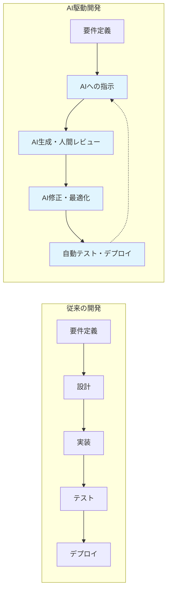

### 主要パラダイム

| パラダイム | 説明 | 特徴 |
|-----------|------|------|
| **Vibe Coding** | 直感的・対話的なAIとの協働開発 | 高速プロトタイピング、創造性重視 |
| **Prompt Engineering** | 構造化されたAIへの指示設計 | 再現性、品質管理、本番コード向け |
| **AI Pair Programming** | AIをペアプログラマーとして活用 | リアルタイムレビュー、学習効果 |

---

## スキルセット全体像

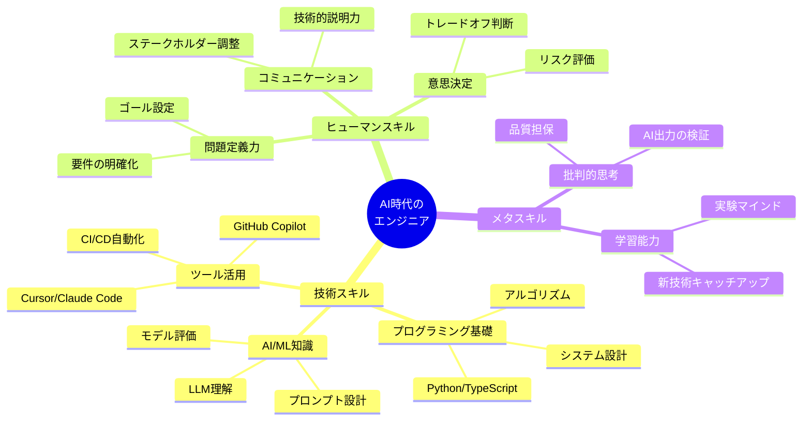

---

## 4つのコアコンピテンシー

AI時代のエンジニアに求められる4つの役割を定義します。

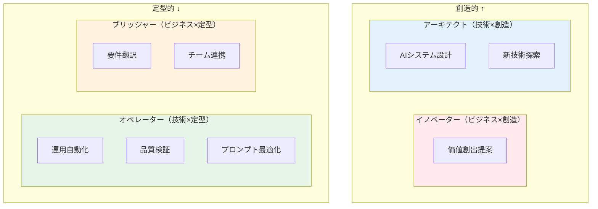

### 1. アーキテクト（設計者）
AIが生成したコードを**統合・設計**する能力
- システム全体の整合性を保つ
- 技術的負債を管理する
- スケーラビリティを考慮した設計

### 2. オペレーター（運用者）
AIツールを**効率的に運用**する能力
- 適切なツール選択
- プロンプトの最適化
- 品質管理プロセスの構築

### 3. ブリッジャー（橋渡し役）
技術とビジネスを**つなぐ**能力
- 要件を技術的制約に変換
- ステークホルダーへの説明
- 期待値の調整

### 4. イノベーター（革新者）
AIでは生み出せない**新しい価値**を創出する能力
- 問題の再定義
- 創造的な解決策の提案
- 新しいユースケースの発見

---

## レベル別スキルマトリクス（定性・定量）

### スキルレベル定義

| レベル | 名称 | 経験目安 | 特徴 |
|--------|------|----------|------|
| L1 | Beginner | 0-6ヶ月 | AIツールの基本操作ができる |
| L2 | Intermediate | 6-12ヶ月 | AIと協働して中規模タスクを完遂できる |
| L3 | Advanced | 1-2年 | AIシステム全体を設計・運用できる |
| L4 | Expert | 2年以上 | 組織のAI活用を推進・指導できる |

---

### 技術スキル（定量指標付き）

#### プログラミング・開発基礎

| スキル | L1 | L2 | L3 | L4 |
|--------|-----|-----|-----|-----|
| **Python/TypeScript** | 基本文法理解、100行程度のスクリプト | 1000行規模のアプリ開発、型定義活用 | 複数リポジトリの設計、パフォーマンス最適化 | アーキテクチャ設計、言語選定の判断 |
| 定量指標 | コード100行/日 | コード300行/日、PR 5件/週 | 設計ドキュメント作成、レビュー10件/週 | 技術選定3件以上/年 |
| **Git/バージョン管理** | add, commit, push, pull | ブランチ戦略理解、コンフリクト解決 | CI/CDパイプライン構築 | チーム開発フロー設計 |
| 定量指標 | 日次コミット | PR作成5件/週、レビュー対応 | パイプライン構築2件以上 | フロー改善提案3件/年 |
| **テスト** | 手動テスト実行 | ユニットテスト作成、カバレッジ60%以上 | E2Eテスト、テスト戦略設計 | テスト文化の組織浸透 |
| 定量指標 | テストケース実行 | テストコード比率30%、カバレッジ60% | カバレッジ80%、E2Eテスト導入 | チーム全体カバレッジ80%維持 |

#### AI/LLMスキル

| スキル | L1 | L2 | L3 | L4 |
|--------|-----|-----|-----|-----|
| **プロンプト設計** | 基本的な指示、1ターン対話 | Few-shot、Chain of Thought活用 | システムプロンプト設計、評価指標設定 | プロンプトライブラリ構築、組織展開 |
| 定量指標 | プロンプト10パターン習得 | 50パターン、成功率70%以上 | 評価フレームワーク構築、成功率85% | 100パターン以上、チーム共有 |
| **AI出力レビュー** | 動作確認レベル | セキュリティ・品質チェック | 自動レビューパイプライン構築 | レビュー基準策定・教育 |
| 定量指標 | レビュー10件/週 | レビュー30件/週、修正率計測 | 自動チェック導入、誤検知率5%以下 | レビューガイドライン策定 |
| **RAG/エージェント** | 概念理解 | 既存フレームワークでの実装 | カスタムエージェント開発 | プロダクション運用、最適化 |
| 定量指標 | チュートリアル完了 | RAGアプリ1つ構築 | エージェント2つ以上開発 | 本番稼働、SLA 99.5%以上 |

#### インフラ・MLOps

| スキル | L1 | L2 | L3 | L4 |
|--------|-----|-----|-----|-----|
| **クラウド** | マネージドサービス利用 | IaC基礎（Terraform/Pulumi） | マルチクラウド設計 | コスト最適化、ガバナンス |
| 定量指標 | 1サービスデプロイ | 環境構築自動化 | 3環境以上管理 | コスト20%削減達成 |
| **コンテナ** | Dockerファイル作成 | docker-compose活用 | Kubernetes基礎 | 本番K8s運用 |
| 定量指標 | イメージ作成10個 | マルチコンテナ構成 | クラスタ構築・運用 | SLA 99.9%達成 |
| **MLOps** | モデルAPIの利用 | 実験管理（MLflow等） | モデル評価パイプライン | 本番モデル運用・監視 |
| 定量指標 | API呼び出し実装 | 実験10件以上管理 | A/Bテスト実施 | モデル更新サイクル確立 |

---

### ヒューマンスキル（定性指標付き）

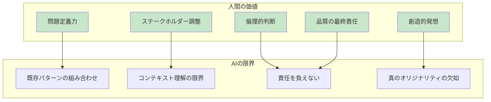

#### 問題定義・要件整理

| スキル | L1 | L2 | L3 | L4 |
|--------|-----|-----|-----|-----|
| **要件抽出** | 明示された要件の理解 | 暗黙の要件の発見・確認 | ビジネス価値との紐付け | 問題の再定義・新規提案 |
| 定性指標 | 要件の言い換えができる | 「なぜ」を5回聞ける | ROI試算ができる | 経営層への提案ができる |
| **スコープ管理** | 作業範囲の把握 | 優先順位付けの提案 | トレードオフの明示 | ステークホルダー調整 |
| 定性指標 | タスク分解ができる | MoSCoW分類できる | 代替案を3つ提示できる | 合意形成をリードできる |

#### コミュニケーション

| スキル | L1 | L2 | L3 | L4 |
|--------|-----|-----|-----|-----|
| **技術説明** | 技術者への説明 | 非技術者への平易な説明 | 経営層へのビジネス視点説明 | 対外発表・講演 |
| 定性指標 | 同僚に説明できる | PMに説明できる | CxOに説明できる | カンファレンス登壇 |
| **ドキュメント** | コメント・READMEの作成 | 設計ドキュメント作成 | アーキテクチャ文書 | 組織知識ベース構築 |
| 定性指標 | 自分用メモ | チーム共有可能 | 新人が読んで理解可能 | 組織標準として採用 |

#### 意思決定・判断

| スキル | L1 | L2 | L3 | L4 |
|--------|-----|-----|-----|-----|
| **技術選定** | 既存技術の利用 | 比較検討の実施 | 採用判断と責任 | 技術戦略策定 |
| 定性指標 | 指示された技術を使える | 3つ以上比較できる | 採用理由を説明できる | 中長期方針を示せる |
| **リスク評価** | リスクの認識 | リスクの定量化 | 緩和策の立案・実行 | リスク管理体制構築 |
| 定性指標 | 問題を報告できる | 影響範囲を試算できる | 対策を主導できる | 予防的管理ができる |

---

## フェーズ別アクションプラン

### Phase 1: 基礎固め（0-6ヶ月）

**目標**: AIツールを使った基本的な開発ができる状態

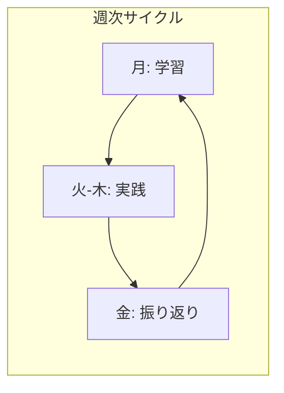

#### 技術スキル習得

| 週 | テーマ | 具体的アクション | 成果物 | チェックポイント |
|----|--------|-----------------|--------|-----------------|
| 1-2 | Python基礎 | - Pythonチュートリアル完了 - 100問以上のコーディング問題 | AtCoder/LeetCode 50問解答 | FizzBuzzを3分以内に書ける |
| 3-4 | Git/GitHub | - Git操作の完全習得 - OSS リポジトリにスター・Watch | GitHubプロフィール整備、リポジトリ3つ | ブランチ作成からPRマージまで一人でできる |
| 5-8 | AIツール導入 | - Cursor or Copilotセットアップ - 毎日1時間AIと対話してコーディング | AIアシストで作成したアプリ1つ | 「AIに何を聞くべきか」がわかる |
| 9-12 | プロンプト基礎 | - 基本プロンプトパターン10種習得 - 失敗プロンプトの分析・改善 | プロンプト集（10パターン以上） | 同じタスクで3種類のプロンプトを試せる |
| 13-20 | 小規模開発 | - ToDoアプリ、天気アプリ等を3つ作成 - 各プロジェクトでAI活用度を上げる | 完成アプリ3つ（GitHubで公開） | 要件からデプロイまで1週間以内 |
| 21-24 | 振り返り・整理 | - 学習ログの整理 - 技術ブログ1本執筆 | 技術ブログ記事1本 | 自分の学習を他者に説明できる |

#### ヒューマンスキル習得

| 期間 | テーマ | 具体的アクション | 成果物 |
|------|--------|-----------------|--------|
| 月1回 | 言語化練習 | 自分のコードを5分で説明する練習 | 説明動画（自分用）3本 |
| 週1回 | 質問力向上 | 技術コミュニティで質問1つ投稿 | 質問投稿履歴（24件） |
| 随時 | 情報収集 | 技術ニュースを毎日15分チェック | ブックマーク・メモ蓄積 |

---

### Phase 2: 実践力強化（6-12ヶ月）

**目標**: 複雑なタスクをAIと協働で解決できる状態

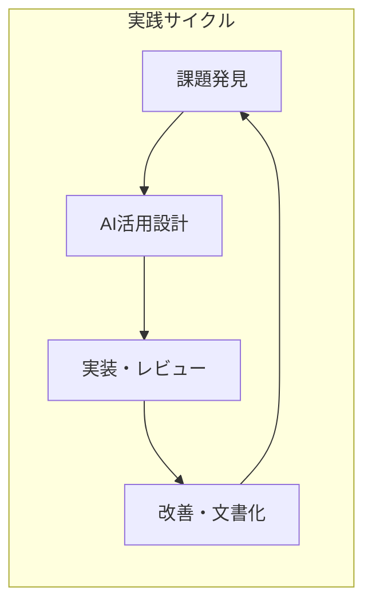

#### 技術スキル習得

| 月 | テーマ | 具体的アクション | 成果物 | チェックポイント |
|----|--------|-----------------|--------|-----------------|
| 7 | 高度プロンプト | - Chain of Thought, Few-shotの実践 - プロンプトA/Bテスト10件実施 | プロンプトパターン集（30種追加） | 複雑なタスクを分割指示できる |
| 8 | コードレビュー | - AI生成コードの品質チェック習慣化 - セキュリティ・パフォーマンス観点追加 | レビューチェックリスト | OWASP Top10を説明できる |
| 9-10 | API設計・実装 | - RESTful API設計原則の習得 - FastAPI/Expressで実装 | 本格的なAPI 1つ（認証付き） | OpenAPI仕様書を作成できる |
| 11 | テスト戦略 | - pytest/Jestでのテスト実装 - カバレッジ80%達成 | テスト付きプロジェクト | TDDで小規模機能を実装できる |
| 12 | 統合・発表 | - 中規模アプリケーション完成 - 技術ブログ or LT発表 | 中規模アプリ1つ、発表資料 | 15分で技術選定理由を説明できる |

#### プロジェクト例（中規模アプリ）

| プロジェクト案 | 技術スタック | 学習ポイント |
|---------------|-------------|-------------|
| AIチャットボット | Python, FastAPI, OpenAI API, PostgreSQL | API設計、状態管理、プロンプト設計 |
| コード解説ツール | TypeScript, Next.js, Claude API | フロントエンド、ストリーミング処理 |
| 議事録自動生成 | Python, Whisper, GPT-4, S3 | 音声処理、非同期処理、ファイル管理 |

#### ヒューマンスキル習得

| 期間 | テーマ | 具体的アクション | 成果物 |
|------|--------|-----------------|--------|
| 月2回 | ペアプログラミング | 同僚 or コミュニティでペアプロ | 実施記録6回分 |
| 月1回 | 技術共有 | チーム内LT or 勉強会発表 | 発表資料6本 |
| 随時 | レビュー参加 | 他者のPRレビューに積極参加 | レビューコメント100件以上 |

---

### Phase 3: 応用力獲得（1-2年）

**目標**: AIシステム全体を設計・運用できる状態

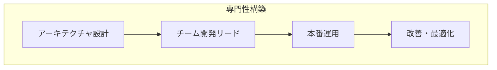

#### 技術スキル習得

| 四半期 | テーマ | 具体的アクション | 成果物 | チェックポイント |
|--------|--------|-----------------|--------|-----------------|
| Q1 | システム設計 | - アーキテクチャパターン学習 - 設計ドキュメント作成練習 | 設計ドキュメント3本 | ADR（Architecture Decision Record）を書ける |
| Q2 | AIエージェント開発 | - LangChain/LlamaIndexでの開発 - マルチエージェント実装 | 本番稼働エージェント1つ | エージェントの評価指標を設計できる |
| Q3 | MLOps実践 | - 実験管理、モデルバージョニング - 評価パイプライン構築 | MLパイプライン1つ | モデル更新のロールバックができる |
| Q4 | 組織貢献 | - 社内AI活用ガイドライン策定 - 後進の育成 | ガイドライン文書、育成記録 | 新人に3ヶ月で基礎を教えられる |

#### ヒューマンスキル習得

| 期間 | テーマ | 具体的アクション | 成果物 |
|------|--------|-----------------|--------|
| 四半期1回 | 外部発表 | カンファレンス登壇 or 技術記事（外部メディア） | 発表・記事4本/年 |
| 月1回 | メンタリング | ジュニアエンジニアの1on1 | メンタリング記録 |
| 随時 | 意思決定 | 技術選定の主導 | 選定ドキュメント |

---

### Phase 4: エキスパート（2年以上）

**目標**: 組織のAI活用を推進・指導できる状態

#### 活動領域

| 領域 | 具体的アクション | 成果指標 |
|------|-----------------|----------|
| **技術戦略** | AI技術ロードマップ策定、投資判断 | 戦略ドキュメント、予算承認 |
| **組織開発** | AI人材育成プログラム設計・運営 | 育成人数、スキル向上率 |
| **対外活動** | カンファレンス登壇、執筆、OSS貢献 | 登壇数、スター数、引用数 |
| **ビジネス貢献** | AI活用によるROI創出 | コスト削減額、売上貢献 |

---

## アンチパターン

AI駆動開発において**やってはいけないこと**を明確にします。

### 危険度マトリクス

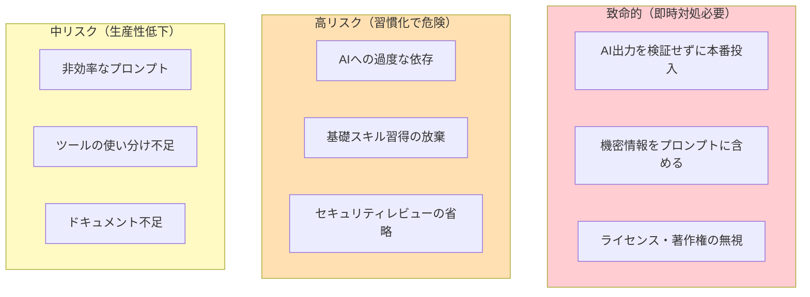

---

### 致命的アンチパターン

#### 1. 盲目的信頼（Blind Trust）

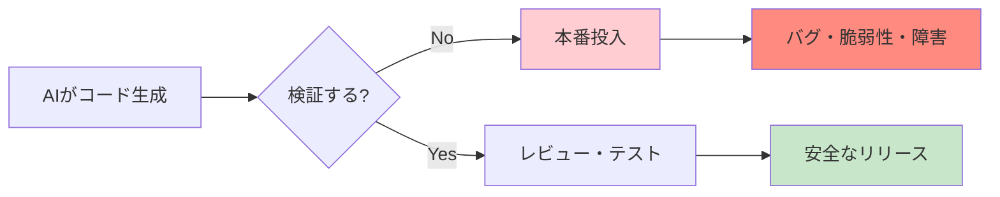

| 問題 | 詳細 | 対策 |
|------|------|------|
| **症状** | AI生成コードをそのままコピペ、テストなしでマージ | - |
| **リスク** | セキュリティ脆弱性、ロジックエラー、パフォーマンス問題 | - |
| **対策** | 全AI出力に対してレビュー必須、自動テスト通過を条件化 | レビューチェックリスト導入 |
| **指標** | AI生成コードのバグ率を計測し、改善サイクルを回す | バグ率 < 5%を目標 |

#### 2. 機密情報漏洩（Data Leakage）

| 問題 | 詳細 | 対策 |
|------|------|------|
| **症状** | APIキー、個人情報、社内コードをプロンプトに含める | - |
| **リスク** | 情報漏洩、コンプライアンス違反、セキュリティインシデント | - |
| **対策** | ローカルLLM活用、プロンプトのサニタイズ、教育徹底 | プロンプトレビュー体制 |
| **指標** | プロンプト監査を定期実施、違反検出時は即時対応 | 違反0件を維持 |

#### 3. ライセンス違反（License Violation）

| 問題 | 詳細 | 対策 |
|------|------|------|
| **症状** | AI生成コードの出典・ライセンスを確認せず使用 | - |
| **リスク** | 著作権侵害、GPL汚染、法的リスク | - |
| **対策** | ライセンスチェッカー導入、出典不明コードは使用禁止 | 法務確認フロー |
| **指標** | OSS利用時は必ずライセンス確認、記録を残す | 確認率100% |

---

### 高リスクアンチパターン

#### 4. AI依存症（Over-Reliance）

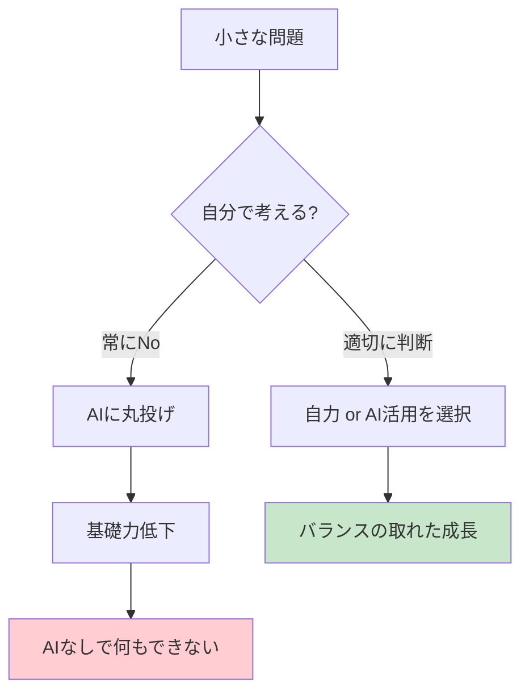

| 問題 | 詳細 | 対策 |
|------|------|------|
| **症状** | 簡単な問題もAIに聞く、エラーメッセージを読まない | - |
| **リスク** | デバッグ力・問題解決力の低下、AIなしで作業不能 | - |
| **対策** | 「まず5分自分で考える」ルール、週1回AI禁止日 | 自力解決率を計測 |
| **指標** | 自力解決率50%以上を維持、段階的にAI活用 | - |

#### 5. 基礎スキップ（Skipping Fundamentals）

| 問題 | 詳細 | 対策 |
|------|------|------|
| **症状** | アルゴリズム、データ構造、設計原則を学ばない | - |
| **リスク** | AI出力の良し悪しを判断できない、応用が利かない | - |
| **対策** | 基礎学習時間を週5時間確保、資格取得も検討 | 学習ログ管理 |
| **指標** | 基礎知識テスト80%以上、コードレビューで指摘できる | - |

#### 6. セキュリティ軽視（Security Negligence）

| 問題 | 詳細 | 対策 |
|------|------|------|
| **症状** | AI生成コードのセキュリティチェックを省略 | - |
| **リスク** | SQLインジェクション、XSS、認証バイパス等の脆弱性 | - |
| **対策** | SAST/DASTツール必須化、セキュリティレビューチェックリスト | 脆弱性スキャン自動化 |
| **指標** | Critical/High脆弱性0件、定期的なペネトレーションテスト | - |

---

### 中リスクアンチパターン

#### 7. 雑なプロンプト（Lazy Prompting）

| 問題 | 詳細 | 対策 |
|------|------|------|
| **症状** | 「〇〇作って」のような曖昧な指示、コンテキスト不足 | - |
| **リスク** | 低品質な出力、手戻り増加、時間浪費 | - |
| **対策** | プロンプトテンプレート活用、CRISPE等のフレームワーク | 成功プロンプト蓄積 |
| **指標** | プロンプト成功率80%以上、平均リトライ回数2回以下 | - |

#### 8. ツール固執（Tool Lock-in）

| 問題 | 詳細 | 対策 |
|------|------|------|
| **症状** | 1つのツールしか使わない、新ツールを試さない | - |
| **リスク** | 最適なツール選択ができない、ベンダーロックイン | - |
| **対策** | 四半期に1つ新ツールを試す、ツール比較表を作成 | 定期的なツール評価 |
| **指標** | 3つ以上のツールを使い分けられる | - |

#### 9. ドキュメント不足（Documentation Debt）

| 問題 | 詳細 | 対策 |
|------|------|------|
| **症状** | AIとのやり取りを記録しない、決定理由が不明 | - |
| **リスク** | 再現性がない、引き継ぎ困難、同じ失敗を繰り返す | - |
| **対策** | プロンプトログの保存、ADR（決定記録）の作成 | ナレッジベース構築 |
| **指標** | 主要な決定にはADRが存在、プロンプトは検索可能 | - |

---

### アンチパターンチェックリスト

日次・週次で確認するチェックリスト：

#### 日次チェック
- [ ] AI生成コードを本番投入前にレビューしたか
- [ ] 機密情報をプロンプトに含めていないか
- [ ] 今日、自分の頭で問題を解決する時間があったか

#### 週次チェック
- [ ] セキュリティスキャンを実行したか
- [ ] 失敗したプロンプトを分析・改善したか
- [ ] 学習時間（基礎スキル）を確保したか
- [ ] ドキュメントを更新したか

#### 月次チェック
- [ ] 新しいツール・手法を試したか
- [ ] AI活用のROI（効率改善度）を振り返ったか
- [ ] チームへの知見共有を行ったか

---

## ツールエコシステム

### 主要AIコーディングツール比較

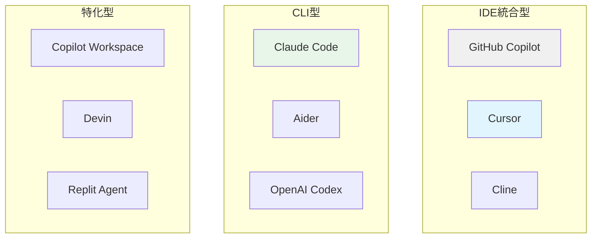

### ツール選択フローチャート

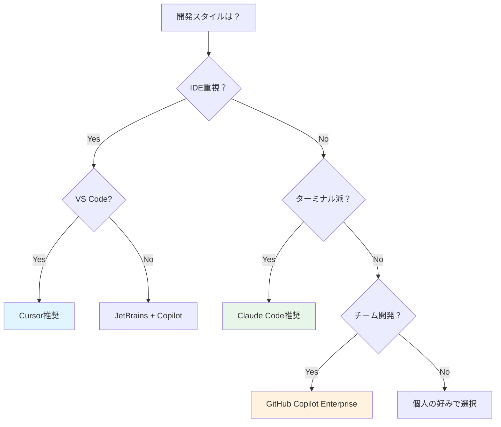

### ツール別特徴

| ツール | 強み | 適したシーン | 注意点 |
|-------|------|-------------|--------|
| **Cursor** | IDE統合、高品質コード | 本番開発、チーム開発 | 学習コスト |
| **Claude Code** | ターミナル統合、自動化 | CLI操作、スクリプト | GUIなし |
| **GitHub Copilot** | 広い言語対応、安定性 | 既存ワークフロー維持 | カスタマイズ限定 |
| **Aider** | Git統合、軽量 | 既存プロジェクト修正 | セットアップ複雑 |

---

## キャリアパス

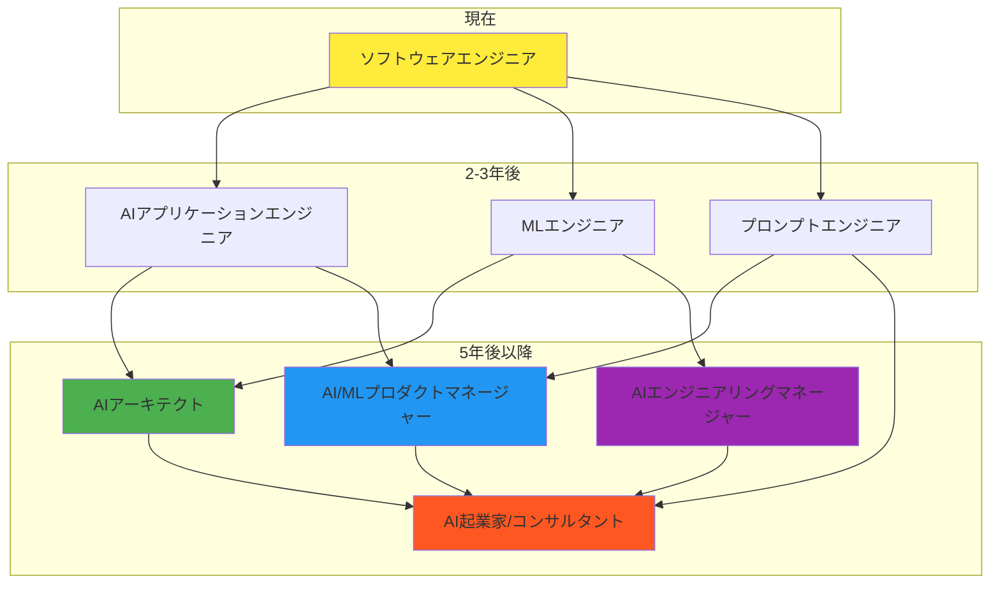

### 年収レンジ（2026年予測）

| ポジション | 日本市場 | US市場 |
|-----------|---------|--------|
| ジュニアAIエンジニア | 400-600万円 | $80-120K |
| ミドルAIエンジニア | 600-900万円 | $120-160K |
| シニアAIエンジニア | 900-1400万円 | $150-200K |
| AIアーキテクト | 1200-2000万円 | $175-250K |
| AI/MLリード | 1500万円以上 | $200K以上 |

---

## 参考リソース

### 公式ドキュメント・ガイド
- [AI Engineer Roadmap - roadmap.sh](https://roadmap.sh/ai-engineer)
- [How to Become an AI Engineer in 2026 - KDnuggets](https://www.kdnuggets.com/how-to-become-an-ai-engineer-in-2026-a-self-study-roadmap)
- [AI Developer Roadmap: 12-Month Learning Path - DataCamp](https://www.datacamp.com/blog/ai-developer-roadmap)

### 日本語リソース
- [AI時代のITエンジニアの付加価値について - NRIネットコムBlog](https://tech.nri-net.com/entry/value_of_it_engineers_in_the_age_of_ai)
- [AIエージェント時代に必要なスキル【2025年最新版】- Zenn](https://zenn.dev/taku_sid/articles/20250409_ai_agent_skills)
- [AI駆動開発の完全ガイド - AIworker](https://note.com/ai__worker/n/na7b51bc39a53)
- [AI時代に求められる4つの役割 - @IT](https://atmarkit.itmedia.co.jp/ait/articles/2601/06/news007.html)

### ツール関連
- [Vibe Coding Explained - Google Cloud](https://cloud.google.com/discover/what-is-vibe-coding)
- [Prompt Engineering + Vibe Coding - Syncfusion](https://www.syncfusion.com/blogs/post/prompt-engineering-vibe-coding)
- [AI Code Comparison: Copilot vs Cursor vs Claude Code - Augment Code](https://www.augmentcode.com/tools/ai-code-comparison-github-copilot-vs-cursor-vs-claude-code)
- [Claude Code vs Cursor: Deep Comparison - Qodo](https://www.qodo.ai/blog/claude-code-vs-cursor/)

### 学習プラットフォーム
- [AI Engineer Roadmap 2026 - Codebasics](https://codebasics.io/resources/ai-engineer-roadmap-2026)
- [Roadmap to Becoming an AI Engineer - Analytics Vidhya](https://www.analyticsvidhya.com/blog/2024/04/roadmap-to-become-an-ai-engineer/)

---

## まとめ：成功のための3つの原則

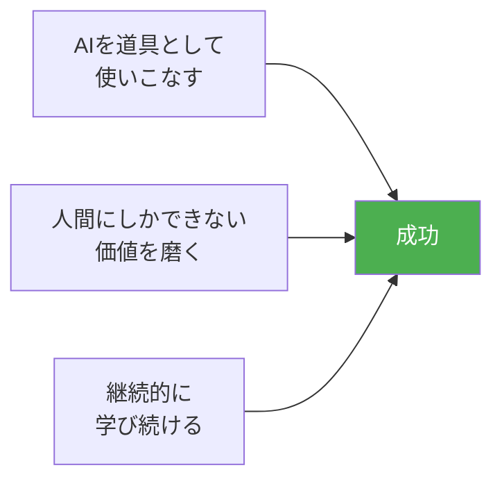

1. **AIを恐れず、活用する**: AIは脅威ではなくパートナー。積極的に取り入れる
2. **差別化要素を磨く**: 問題定義力、コミュニケーション、創造性に投資する
3. **学習を止めない**: 技術は進化し続ける。実験と学習を習慣化する

---

*このドキュメントは2026年2月時点の情報に基づいています。AI技術の急速な進化に伴い、定期的な更新を推奨します。*
