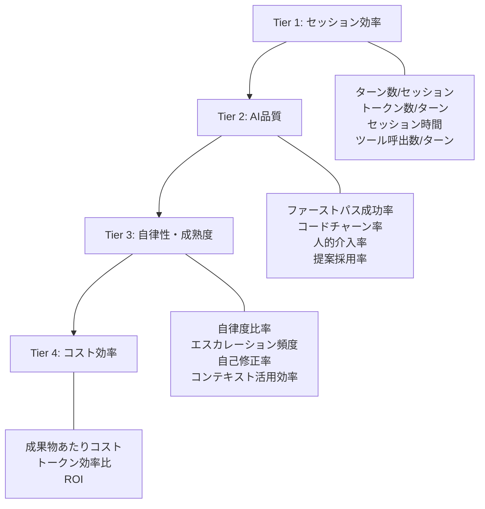
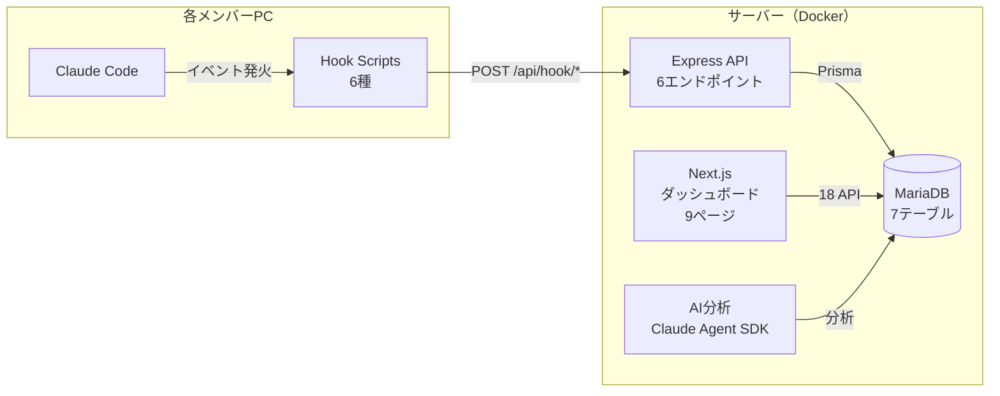
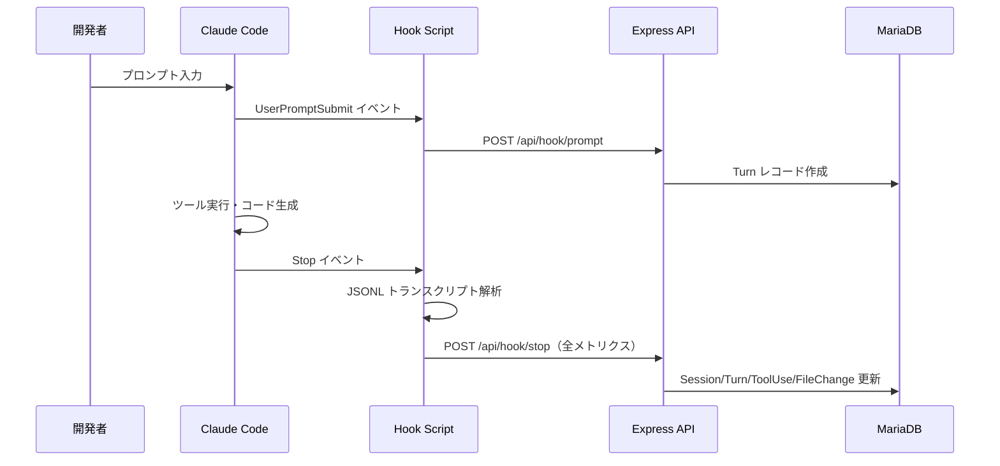

## はじめに: AI活用の「感覚と実態のギャップ」

「メンバー全員、Claude Code をもっと使うべきだ。MAX×20プランを使い切るぐらい活用してほしい」

上長からこう言われたとき、返す言葉がありませんでした。チームに Claude Code の Max プランを導入して数ヶ月。「便利になった」「コードレビューが楽になった」という声は聞こえてくるものの、**実際にどのメンバーがどれくらい使っていて、どんなタスクに活用しているのか**――そのデータがどこにもなかったのです。

:::message alert
METR（Model Evaluation & Threat Research）の研究では、経験豊富な開発者16人を対象としたランダム化比較試験で、AIツール使用時に生産性が **19%低下** したという結果が報告されています。しかも開発者自身は「24%速くなった」と予想し、実験後も「20%速くなった」と感じていました。**体感と実態のギャップ**は他人事ではありません。
:::

「なんとなく便利」では投資対効果を示せません。チームの AI 活用を改善するには、まず **計測できる状態** を作る必要があります。

そこで構築したのが、Claude Code の **Hooks API** を使ったチーム利用状況の自動収集・可視化システムです。本記事では、KPI設計から実装・運用までを再現可能な形で解説します。

## KPI成熟度モデル: 何を測るべきか

AI コーディングツールの効果をどう定義し、何を測るべきでしょうか。単純な「コード生成行数」や「使用時間」では本質を捉えられません。

チーム運用の中で見えてきた計測軸を、4つのティアに体系化しました。

### 4ティアKPI体系



各ティアの具体的な判定基準は以下のとおりです。

| レベル | ターン数/セッション | ファーストパス成功率 | 自律度比率 | 日次コスト目安 |
|--------|---------------------|---------------------|-----------|---------------|
| Expert | 3〜8 | 70%以上 | 80%以上 | $4以下 |
| Advanced | 9〜15 | 50〜70% | 60〜80% | $4〜8 |
| Intermediate | 16〜25 | 30〜50% | 40〜60% | $8〜15 |
| Beginner | 25以上 | 30%未満 | 40%未満 | $15以上 |

**Tier 1（セッション効率）** は最も基礎的な指標です。1セッションあたりのターン数が3〜8回なら効率的、40回を超えると非効率なセッションの可能性があります。ツール呼出数が多ければ AI が自律的に作業を進めている証拠になります。

**Tier 2（AI品質）** は、AI の提案がどれだけ「一発で通る」かを測ります。ファーストパス成功率が60%を超えていれば良好、コードチャーン率（AI が書いたコードが72時間以内に書き直される割合）が30%を超えていると要改善です。

**Tier 3（自律性・成熟度）** は、人間の介入なしに AI がどこまで自走できるかの指標です。自律度比率80%以上がエキスパートレベルです。

**Tier 4（コスト効率）** は投資対効果の核心です。成果物（PR・バグ修正等）あたりのコストや、トークン効率比（消費トークン÷採用されたコード行数）で測ります。

:::message
Tier 1 から順に計測環境を整えていくのがおすすめです。本記事で紹介するシステムは主に Tier 1 と Tier 4 をカバーし、Tier 2・3 のデータ基盤も提供します。
:::

## アーキテクチャ設計

### 全体構成



各メンバーの PC に配置した **6種のフックスクリプト** が、Claude Code のライフサイクルイベント（セッション開始・プロンプト送信・ツール実行・応答完了・セッション終了）を検知し、中央サーバーに自動送信します。メンバーは普段の開発作業をそのまま行うだけで、データが蓄積されていきます。

### 設計判断: なぜこの構成にしたのか

同様のシステムを自作する際に参考になるよう、主要な設計判断とその理由を整理します。

:::details 設計判断の詳細

**Q1: なぜ Hooks API なのか（OpenTelemetry ではなく）**

Claude Code の Hooks API は、セッションのライフサイクルイベントに対してシェルスクリプトを登録できる仕組みです。OTel（OpenTelemetry）ベースのアプローチ（`claude-code-otel` など）も存在しますが、以下の理由で Hooks API を選択しました。

- JSONL トランスクリプトに直接アクセスでき、ツール使用・ファイル変更・エラーなど **粒度の細かいデータ** を取得可能
- セットアップが `~/.claude/settings.json` への記述のみで完結し、追加のインフラ（OTel Collector, Jaeger/Grafana）が不要
- Claude Code のプロセスと同期実行されるため、トランスクリプトファイルの存在が保証される

**Q2: なぜ中央サーバー方式なのか（ローカル集計ではなく）**

チーム横断の比較分析・リアルタイム監視・AI分析チャットを実現するには、データを1箇所に集約する必要があります。各メンバーのローカルで集計する方式では、これらの機能を実現できません。

**Q3: なぜ MariaDB なのか**

セッション・ターン・ツール使用のリレーショナルな構造と、Prisma ORM との親和性を重視しました。時系列データの量はチーム規模（数名〜数十名）であれば RDB で十分です。

**Q4: フックスクリプトの実行パフォーマンス**

Hooks API はClaude Code のプロセスと同期実行されます。API送信でブロッキングが発生すると開発体験を阻害するため、フックスクリプト内で HTTP リクエストを非同期（バックグラウンド）で送信し、即座にプロセスを返す設計にしています。

:::

### 6種のフックイベント

| フック | タイミング | 取得データ |
|--------|----------|-----------|
| SessionStart | セッション開始 | モデル名、開始種別、Git リポジトリ・ブランチ |
| UserPromptSubmit | プロンプト送信 | プロンプト全文 |
| SubagentStart | サブエージェント起動 | エージェント種別（Bash/Explore/Plan等） |
| SubagentStop | サブエージェント終了 | トークン消費量、ツール使用記録 |
| **Stop** | **応答完了** | **トランスクリプト解析 → 全メトリクス** |
| SessionEnd | セッション終了 | 終了理由（user_exit/clear/logout） |

最も重要なのは **Stop フック** です。Claude Code が応答を完了するたびに発火し、JSONL 形式のトランスクリプトファイルを解析して、セッション全体のトークン消費量・ツール使用・ファイル変更・エラー数などを一括で集計します。

### データフロー



## DB設計: 7テーブルの構造

データモデルは7テーブルで構成されています。

| テーブル | 役割 | 主なカラム |
|---------|------|-----------|
| Member | メンバー情報 | git_email（主キー）、claude_account |
| Session | セッション情報 | session_uuid、total_input_tokens、total_output_tokens、estimated_cost、turn_count |
| Turn | ターン情報 | prompt_text、duration_ms、input_tokens、output_tokens、model |
| Subagent | サブエージェント | agent_type、duration_seconds、input_tokens、output_tokens |
| ToolUse | ツール使用記録 | tool_name、tool_category、status、is_mcp、mcp_server |
| FileChange | ファイル変更記録 | file_path、operation（read/write/edit） |
| SessionEvent | セッションイベント | event_type、event_data（JSON） |

### Prisma スキーマ（Session モデル）

セッション単位でトークン消費量を追跡します。Anthropic のプロンプトキャッシュ機能に対応し、`cache_creation_tokens` と `cache_read_tokens` を分離して記録している点がポイントです。

```prisma:prisma/schema.prisma
model Session {
  id                       Int       @id @default(autoincrement())
  memberId                 Int?      @map("member_id")
  sessionUuid              String    @unique @map("session_uuid")
  model                    String?
  totalInputTokens         Int       @default(0) @map("total_input_tokens")
  totalOutputTokens        Int       @default(0) @map("total_output_tokens")
  totalCacheCreationTokens Int       @default(0) @map("total_cache_creation_tokens")
  totalCacheReadTokens     Int       @default(0) @map("total_cache_read_tokens")
  estimatedCost            Float?    @map("estimated_cost") @db.Double
  turnCount                Int       @default(0) @map("turn_count")
  toolUseCount             Int       @default(0) @map("tool_use_count")
  summary                  String?   @db.Text
  gitRepo                  String?   @map("git_repo")
  gitBranch                String?   @map("git_branch")

  member        Member?        @relation(fields: [memberId], references: [id])
  turns         Turn[]
  toolUses      ToolUse[]
  fileChanges   FileChange[]
  sessionEvents SessionEvent[]

  startedAt             DateTime? @map("started_at")

  @@index([memberId])
  @@index([startedAt])
  @@index([model])
  @@map("sessions")
}
```

:::message
`totalCacheCreationTokens` と `totalCacheReadTokens` を分離記録することで、プロンプトキャッシュのヒット率を後から分析できます。キャッシュヒット率が低い場合、CLAUDE.md やプロジェクト構成の見直しが有効な改善策になります。
:::

## 実装のポイント

### トランスクリプト解析

Stop フックの核心は、Claude Code が出力する JSONL 形式のトランスクリプトファイルの解析です。JSONL の各行は `assistant`、`user`、`system`、`summary` のいずれかの type を持ちます。

```javascript:hooks/lib/transcript-parser.js
function parseTranscript(transcriptPath) {
  const lines = fs.readFileSync(transcriptPath, 'utf8')
    .split('\n').filter(Boolean);

  for (const line of lines) {
    const obj = JSON.parse(line);

    if (obj.type === 'assistant') {
      // トークン数・モデル名を集計
      // tool_use ブロックからツール使用を抽出
      // Write/Edit ツールからファイル変更を記録
    }

    if (obj.type === 'user') {
      // tool_result でなければ新しいターン
      // tool_result のエラーをツール使用記録に反映
    }

    if (obj.type === 'system') {
      // turn_duration: ターンごとの所要時間
      // compact_boundary: コンテキスト圧縮イベント
    }
  }
}
```

### ツールカテゴリの自動分類

ツール使用は7カテゴリに自動分類されます。MCP（Model Context Protocol）ツールは `mcp__` プレフィックスで自動検出し、どの MCP サーバー経由の呼び出しかも記録します。

```javascript:hooks/lib/tool-category.js
function getToolCategory(name) {
  if (/^(Read|Glob|Grep)$/.test(name)) return 'search';
  if (/^(Write|Edit|MultiEdit)$/.test(name)) return 'file_edit';
  if (name === 'Bash') return 'bash';
  if (name === 'Task') return 'subagent';
  if (/^(WebFetch|WebSearch)$/.test(name)) return 'web';
  if (/^mcp__/.test(name)) return 'mcp';
  return 'other';
}
```

:::details 7カテゴリの分類理由
- **search**: コード理解フェーズの指標。Read/Glob/Grep はファイル探索・内容確認に使われる
- **file_edit**: コード生成フェーズの指標。Write/Edit/MultiEdit は実際のコード変更
- **bash**: 外部コマンド実行。テスト実行・ビルド・git操作など
- **subagent**: Task ツールによるサブエージェント起動。複雑なタスクの分割に使用
- **web**: WebFetch/WebSearch による情報収集
- **mcp**: MCP サーバー経由の外部ツール連携（GitHub, Slack, DB等）
- **other**: 上記に分類されないツール

search と file_edit の比率から「AI がどれだけ調査に時間を使ったか vs 実際にコードを書いたか」がわかります。
:::

### コスト計算

モデルごとの単価テーブルに基づき、セッション単位でコストを算出します。プロンプトキャッシュの書き込み・読み込みも個別単価で計算するため、**キャッシュ効率の分析** も可能です。

```typescript:lib/cost-calculator.ts
const COST_TABLE = {
  'claude-opus-4-6':          { input: 15,   output: 75, cacheWrite: 18.75, cacheRead: 1.50 },
  'claude-sonnet-4-5':        { input: 3,    output: 15, cacheWrite: 3.75,  cacheRead: 0.30 },
  'claude-haiku-4-5':         { input: 0.80, output: 4,  cacheWrite: 1.00,  cacheRead: 0.08 },
};

// 単位: USD per 1M tokens
function calculateCost(model: string, usage: TokenUsage): number {
  const rates = COST_TABLE[model];
  return (usage.inputTokens / 1_000_000) * rates.input
       + (usage.outputTokens / 1_000_000) * rates.output
       + (usage.cacheCreationTokens / 1_000_000) * rates.cacheWrite
       + (usage.cacheReadTokens / 1_000_000) * rates.cacheRead;
}
```

:::message
MAX プラン（定額制）の場合、コスト計算は「もし API 従量課金だったらいくらか」という仮想コストとして活用できます。メンバー間の利用量の偏りを定量化するのに有効です。
:::

## インストーラ設計

チーム展開において最も重要なのは、導入の敷居を下げることです。チームメンバーがワンコマンドでセットアップできるインストーラを用意しました。

```bash
bash <(curl -s https://your-server/install.sh)
```

インストーラは以下の4ステップを自動実行します。

**Step 1: フックスクリプトの配置**

6種のフックスクリプトを `~/.claude/hooks/` にダウンロードします。既存のファイルがある場合はバックアップを作成してから上書きします。

**Step 2: 設定ファイルの生成**

API接続先の設定ファイル（`~/.claude/hooks/config.json`）を生成します。サーバーURL とメンバー識別用の git email を設定します。

**Step 3: Claude Code 設定へのマージ**

`~/.claude/settings.json` にフック定義を **安全にマージ** します。

```json:~/.claude/settings.json（マージ後）
{
  "hooks": {
    "SessionStart": [
      { "type": "command", "command": "~/.claude/hooks/session-start.sh" }
    ],
    "UserPromptSubmit": [
      { "type": "command", "command": "~/.claude/hooks/prompt-submit.sh" }
    ],
    "Stop": [
      { "type": "command", "command": "~/.claude/hooks/stop.sh" }
    ],
    "SessionEnd": [
      { "type": "command", "command": "~/.claude/hooks/session-end.sh" }
    ]
  }
}
```

:::message
既存のフック設定がある場合、配列にマージされます。他のフックスクリプトが登録されていても、それらを上書きしたり削除したりしません。
:::

**Step 4: 疎通テスト**

API サーバーへの接続テストを実行し、データ送信が正常に動作することを確認します。

## ダッシュボード: 9つのビュー

構築したダッシュボードは9つのページで構成されています。それぞれが異なる切り口でチームの AI 活用状況を可視化します。

### 1. チーム概要


*チーム全体の利用状況を俯瞰するトップページ*

- **KPIカード**: 総セッション数、総トークン数、推定コスト（前週比トレンド付き）、アクティブメンバー数
- **日次トークン推移**: 入力・出力トークンの折れ線グラフで利用トレンドを把握
- **ツール使用ランキング**: よく使われているツールTop 10（Read、Edit、Bash、Grep 等）
- **ヒートマップ**: 曜日×時間帯 / リポジトリ×日付 / メンバー×日付の3軸で分析可能

「いつ、誰が、どのリポジトリで作業しているか」がひと目でわかります。

### 2. AI分析チャット


*ダッシュボードデータに対して自然言語で質問できるAI分析機能*

チーム概要ページには **AI 分析チャット機能** が統合されています。ダッシュボードのデータをコンテキストとして、Claude Agent SDK を通じて自然言語で質問できます。「今週最もコスト効率が良かったメンバーは？」「Opus と Sonnet の使い分けに偏りはある？」といった分析クエリに即座に回答します。

### 3. メンバー詳細


*個人にドリルダウンした分析ページ*

- **セッション分類**: Quick（短時間）/ Moderate（中程度）/ Complex（複雑）の3段階でセッションを自動分類
- **モデル使用内訳**: Opus / Sonnet / Haiku の使い分けをドーナツチャートで表示
- **ツール使用ランキング**: そのメンバーがよく使うツールの傾向
- **週次トレンド**: 日次の入出力トークン推移

### 4. AIコーチング


*個人データに基づいた改善提案を行うAIコーチング機能*

メンバー詳細ページにも AI 分析が統合されています。個人のデータに基づいた改善提案を受けられます。

- 「セッション時間が長い傾向があります。タスクを細分化してみてはどうですか」
- 「Opus の利用が多いですが、このタイプのタスクなら Sonnet でも十分かもしれません」

こういったコーチングにより、メンバー個人の AI 活用スキルを組織的に底上げできます。

### 5. セッション詳細


*1つのセッションをターン単位で深掘りする分析ページ*

- **ターン別ツリー表示**: 各ターンのプロンプト、AI の応答、ツール使用をツリー構造で展開
- **ツール使用記録**: ツール名・カテゴリ・成否・エラーメッセージをすべて記録
- **サブエージェント**: Task ツール経由で起動されたサブエージェントのモデル・トークン・コストを個別表示
- **ファイル変更**: 操作種別（create/edit/delete/read）を色分けバッジで表示

「このセッションでなぜコストが高くなったのか」「どのツール呼び出しでエラーが発生したのか」をターン単位で追跡できます。

### 6. メンバー一覧


*メンバー全員のランキングと比較ができるページ*

- **ランクバッジ**: トークン消費量でランキングを表示
- **前週比変化率**: 各メンバーの利用量が増加傾向か減少傾向かを可視化
- **メンバー×日付ヒートマップ**: 誰がいつ活発に使っているかのパターンを発見

チーム内での利用格差や、活用が進んでいないメンバーを早期に発見できます。

### 7. プロンプトフィード


*チーム全員のプロンプトをリアルタイムで表示するタイムラインビュー*

- **階層構造**: ユーザー → リポジトリ → ブランチ → セッション → プロンプト
- **自動更新**: 15秒間隔でリアルタイム更新（Play/Pause 切替可能）
- **時間範囲**: 4/8/12/24時間の範囲で表示

「今、チームの誰がどのリポジトリでどんな作業をしているか」をリアルタイムで把握できます。ナレッジ共有のきっかけにもなります――「あ、その問題は先週同じことをやったよ」といった横のコミュニケーションが生まれやすくなります。

### 8. リポジトリ分析


*リポジトリ単位でAI活用状況を比較するページ*

- **リポジトリ別テーブル**: セッション数、トークン数、推定コスト、メンバー数、最終活動日
- **ドリルダウン**: 各リポジトリをクリックすると、ブランチ別統計・コントリビューター別消費量・変更頻度の高いファイル（ホットスポット）を表示

「どのプロジェクトに AI コストが集中しているか」「特定リポジトリの AI 活用が進んでいないのはなぜか」を分析できます。

### 9. トークン分析


*コスト最適化のための分析ページ*

- **トークン予測**: 線形回帰による将来消費量の予測チャート
- **モデル別コスト分布**: Opus / Sonnet / Haiku のコスト比率をドーナツチャートで表示
- **モデルミックスシミュレーション**: 「Opus の利用を30%減らして Sonnet に振り替えたら月額いくら削減できるか」をインタラクティブにシミュレーション

MAX プランではなく API 従量課金の場合、このページがコスト管理の中心になります。

## まとめ: 「なんとなく便利」から「計測可能な生産性」へ

AI コーディングツールの導入効果は、感覚ではなくデータで語る時代に入っています。

本記事で紹介した計測システムでできることをまとめます。

- **チーム全体の AI 活用状況を可視化** -- 誰が、いつ、どのプロジェクトで、どのモデルを使っているか
- **コスト構造を把握** -- モデル別・メンバー別・リポジトリ別のコスト配分と予測
- **セッション品質を分析** -- ターン数・ツール使用・エラー率からセッションの効率を評価
- **リアルタイム監視** -- プロンプトフィードでチームの活動状況をリアルタイム把握
- **AI による分析・コーチング** -- 自然言語クエリと個人別改善提案

この計測基盤があることで、「AI を使えているか」という曖昧な問いに対して、データに基づいた議論ができるようになります。

:::message
今後の展望として、CI/CD パイプラインの DORA メトリクス（デプロイ頻度・変更リードタイム等）との統合や、PR レビュー品質との相関分析を検討しています。AI の活用度と実際のデリバリー成果を結びつけることで、より説得力のある ROI の提示が可能になるはずです。
:::

リポジトリは GitHub で公開しています。Claude Code を使っているチームで、活用状況の可視化に興味がある方はぜひ試してみてください。

https://github.com/thirai-classlab/claude-activity-tracker

---

## 参考リンク

- [METR: Measuring the Impact of AI on Experienced Open-Source Developer Productivity](https://metr.org/)
- [Claude Code Hooks ドキュメント](https://docs.anthropic.com/en/docs/claude-code/hooks)
- [Prisma ORM ドキュメント](https://www.prisma.io/docs)
- [claude-activity-tracker（GitHub）](https://github.com/thirai-classlab/claude-activity-tracker)

---

AI駆動開発の計測・改善に興味がある方はぜひご連絡ください。

https://classlab.co.jp/contact
