# ナレッジ投稿システム 概要設計

> ステータス: **確定**
> 最終更新: 2026-02-16

---

## 1. システム全体像

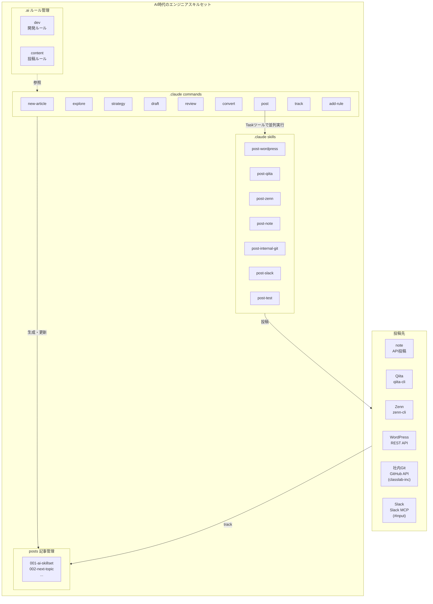

---

## 2. ワークフロー全体

```mermaid
flowchart LR
    P1["Phase 1: INPUT"]
    P2["Phase 2: EXPLORE"]
    P3["Phase 3: STRATEGY"]
    P4["Phase 4: DRAFT"]
    P5["Phase 5: REVIEW"]
    P6["Phase 6: CONVERT"]
    P7["Phase 7: POST"]
    P8["Phase 8: TRACK"]

    P1 --> P2 --> P3 --> P4 --> P5 --> P6 --> P7 --> P8
    P5 -.->|修正| P4
    P8 -.->|次の記事| P1

    GC["/output-idea<br/>/output-draft-from-dev<br/>（グローバルCLI）"]
    GC -.->|ネタ→記事化| P1

    P1:::human
    P2:::collab
    P3:::collab
    P4:::ai
    P5:::human
    P6:::ai
    P7:::ai
    P8:::collab

    classDef human fill:#ffcdd2,stroke:#c62828
    classDef ai fill:#c8e6c9,stroke:#2e7d32
    classDef collab fill:#e3f2fd,stroke:#1565c0
```

**凡例**: 赤=人間主導 / 緑=AI主導 / 青=共同作業

---

## 3. 各Phase詳細

### Phase 1: INPUT `/new-article`

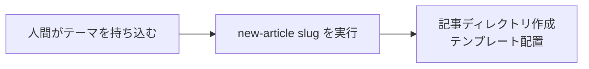

| 項目 | 内容 |
|------|------|
| 主導 | 人間 |
| コマンド | `/new-article {slug}` |
| 成果物 | 記事ディレクトリ + strategy.md（テンプレート）+ explore.md（空）+ images.md（空） |

---

### Phase 2: EXPLORE `/explore`

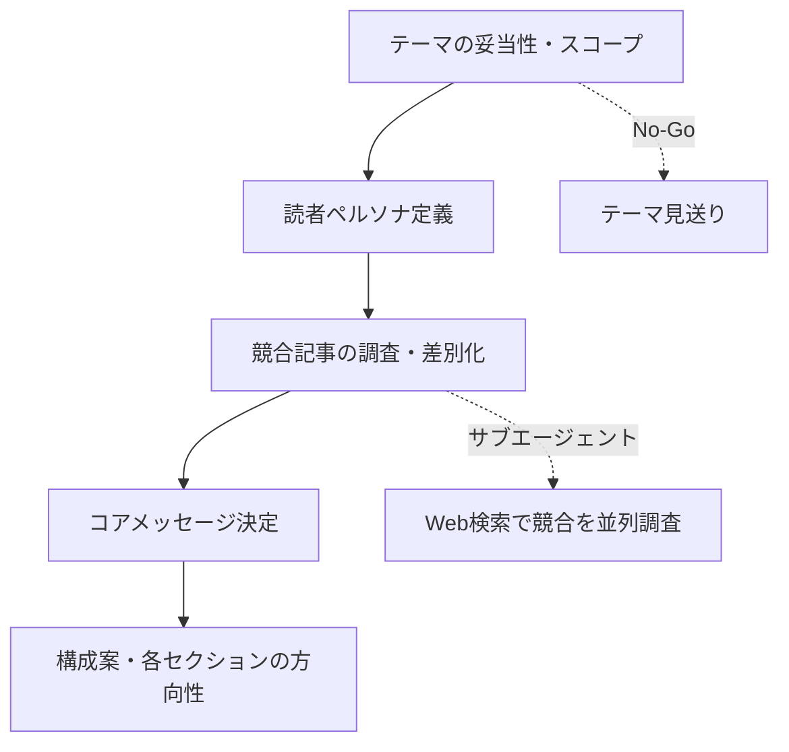

| 項目 | 内容 |
|------|------|
| 主導 | 共同（対話） |
| コマンド | `/explore {記事番号}` |
| ルール参照 | `.ai/content/brainstorm/explore.md` |
| サブエージェント | 競合記事のWeb検索・分析を並列実行 |
| 成果物 | explore.md（対話記録・調査結果） |

---

### Phase 3: STRATEGY `/strategy`

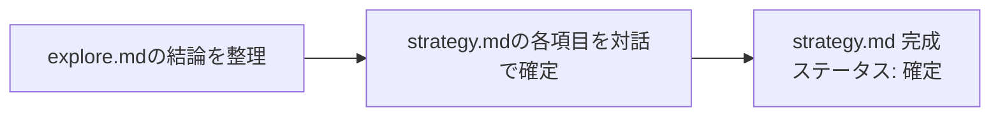

| 項目 | 内容 |
|------|------|
| 主導 | 共同（対話） |
| コマンド | `/strategy {記事番号}` |
| ルール参照 | `.ai/content/strategy/strategy.md`, `template.md` |
| 成果物 | strategy.md（目的・ペルソナ・コアメッセージ・差別化・媒体戦略・タイミング・KPI） |

---

### Phase 4: DRAFT `/draft`

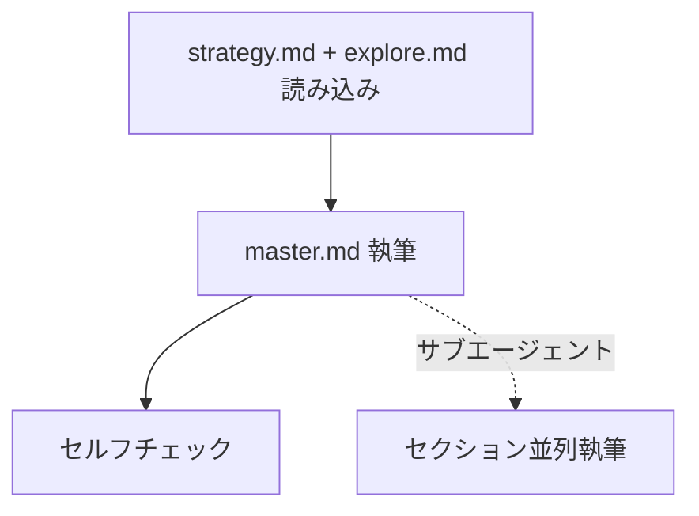

| 項目 | 内容 |
|------|------|
| 主導 | AI |
| コマンド | `/draft {記事番号}` |
| ルール参照 | `.ai/content/writing/draft.md` |
| サブエージェント | 大きな記事はセクション分割で並列執筆 |
| 成果物 | master.md |

---

### Phase 5: REVIEW `/review`

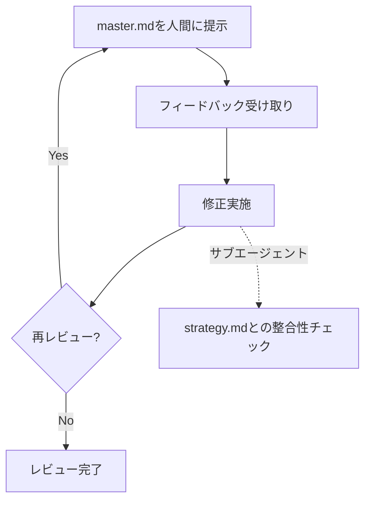

| 項目 | 内容 |
|------|------|
| 主導 | 人間 |
| コマンド | `/review {記事番号}` |
| ルール参照 | `.ai/content/review/review.md` |
| サブエージェント | 修正後の整合性チェック |
| 成果物 | master.md（レビュー済み） |

---

### Phase 6: CONVERT `/convert`

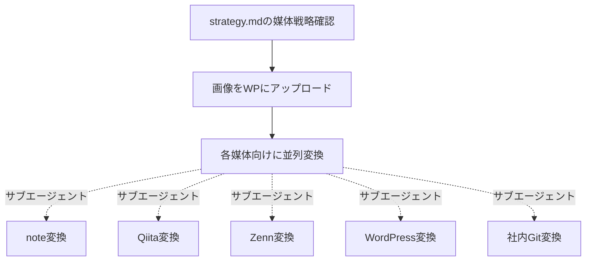

| 項目 | 内容 |
|------|------|
| 主導 | AI |
| コマンド | `/convert {記事番号}` |
| ルール参照 | `.ai/content/posting/common.md`, `images.md`, 各媒体ルール |
| サブエージェント | 5媒体への変換を並列実行 |
| 成果物 | platforms/（5媒体分）、images.md（URL一覧） |

---

### Phase 7: POST `/post`

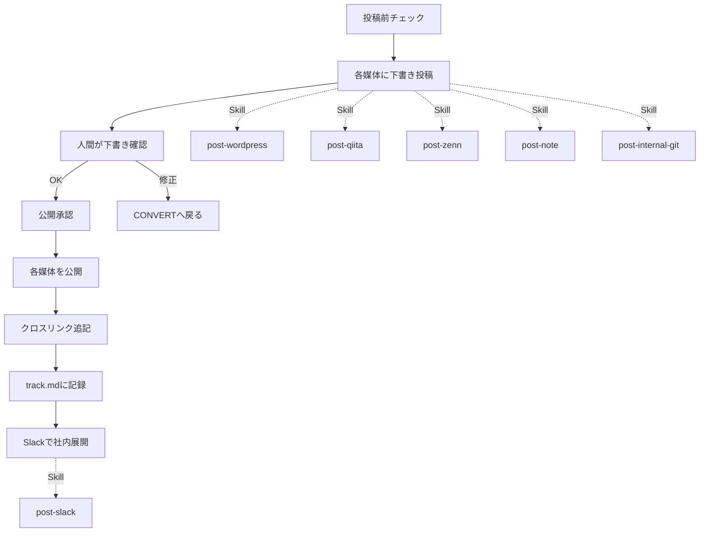

| 項目 | 内容 |
|------|------|
| 主導 | AI（人間が確認・承認） |
| コマンド | `/post {記事番号}` |
| ルール参照 | `.ai/content/posting/common.md`, 各媒体ルール |
| 実行方式 | strategy.md の媒体戦略から投稿先を決定 → 承認された媒体の Skill を Task ツールで並列実行 |
| Skills | post-wordpress, post-qiita, post-zenn, post-note, post-internal-git, post-slack |
| 投稿順序 | WordPress → 他媒体並列 → Slack展開 |
| 成果物 | track.md（投稿記録）、strategy.md（ステータス: 投稿済み） |

---

### Phase 8: TRACK `/track`

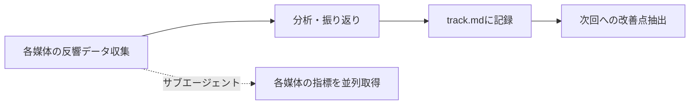

| 項目 | 内容 |
|------|------|
| 主導 | 共同 |
| コマンド | `/track {記事番号}` |
| ルール参照 | `.ai/content/track/track.md` |
| サブエージェント | 各媒体のPV・いいね等を並列取得 |
| 成果物 | track.md（反響記録・改善点） |

---

## 4. プロジェクト構造

```
AI時代のエンジニアスキルセット/
├── CLAUDE.md
├── ideas.md                          ← ネタ帳（/output-idea で追記）
├── .ai/
│   ├── dev/
│   │   ├── structure.md
│   │   ├── commands.md
│   │   └── documentation.md
│   └── content/
│       ├── brainstorm/explore.md
│       ├── strategy/strategy.md
│       ├── strategy/template.md
│       ├── writing/draft.md
│       ├── review/review.md
│       ├── posting/common.md
│       ├── posting/images.md
│       ├── posting/note.md
│       ├── posting/qiita.md
│       ├── posting/zenn.md
│       ├── posting/wordpress.md
│       ├── posting/internal-git.md
│       └── track/track.md
├── .claude/commands/                  ← カスタムコマンド（ワークフロー）
│   ├── new-article.md
│   ├── explore.md
│   ├── strategy.md
│   ├── draft.md
│   ├── review.md
│   ├── convert.md
│   ├── post.md
│   ├── track.md
│   └── add-rule.md
├── ~/.claude/commands/                ← グローバルコマンド（どこからでも実行可能）
│   ├── output-idea.md                    ネタ帳追加
│   └── output-draft-from-dev.md          開発下書き作成
├── .claude/skills/                    ← スキル（サブエージェント実行）
│   ├── post-wordpress/SKILL.md
│   ├── post-qiita/SKILL.md
│   ├── post-zenn/SKILL.md
│   ├── post-note/SKILL.md
│   ├── post-internal-git/SKILL.md
│   ├── post-slack/SKILL.md
│   └── post-test/SKILL.md
├── scripts/                           ← 投稿用スクリプト
│   └── post-note.py                   note.com API投稿
├── tests/                             ← テストスクリプト
├── docs/design/
│   ├── 00-overview.md              ← 本ドキュメント
│   ├── 01-system-design.md
│   ├── 02-strategy-template.md
│   ├── 03-convert-rules.md
│   ├── 04-post-flow.md
│   ├── 05-commands-design.md
│   └── 06-workflow-dataflow.md    ← ワークフロー・データフロー全体図
└── posts/
    ├── README.md
    └── {NNN}-{slug}/
        ├── strategy.md
        ├── explore.md
        ├── master.md
        ├── track.md
        ├── images.md
        └── platforms/
            ├── note.md
            ├── qiita.md
            ├── zenn.md
            ├── wordpress.md
            └── internal-git.md
```

---

## 5. ツールスタック

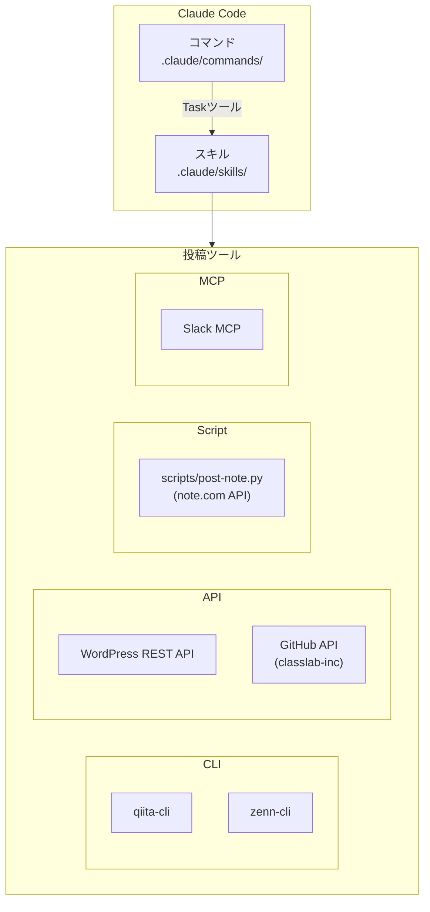

| 種別 | ツール | 用途 | Skill |
|------|--------|------|-------|
| Script | scripts/post-note.py | note投稿（API） | post-note |
| CLI | qiita-cli | Qiita投稿 | post-qiita |
| CLI | zenn-cli | Zenn投稿（git push） | post-zenn |
| API | WordPress REST API + MCP Adapter | WordPress投稿・画像管理（engineer-blog テーマ、ショートコード対応） | post-wordpress |
| API | GitHub API (github-internal) | 社内Git投稿（classlab-inc/document/Knowledge） | post-internal-git |
| MCP | Slack MCP | 社内展開通知（#input） | post-slack |
| AI | Claude Code Commands | ワークフロー制御・コマンド実行 | - |
| AI | Claude Code Skills | 各媒体への投稿をサブエージェントで並列実行 | post-* |
