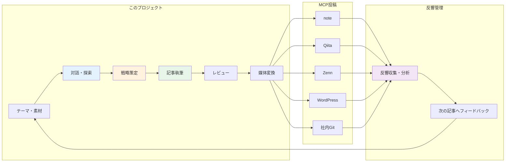
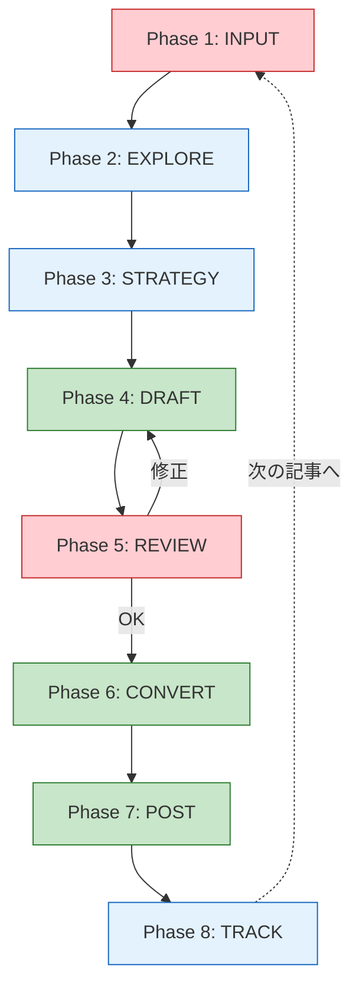
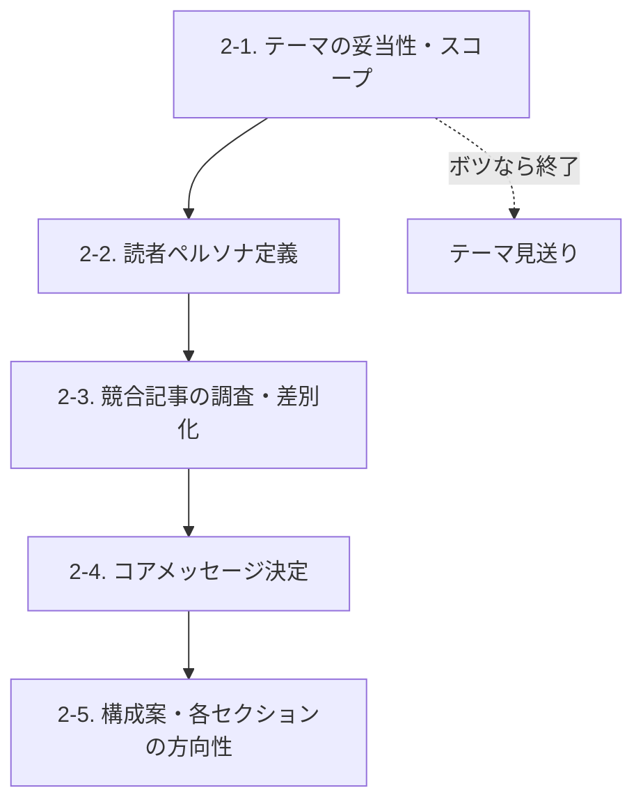
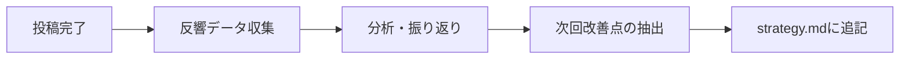
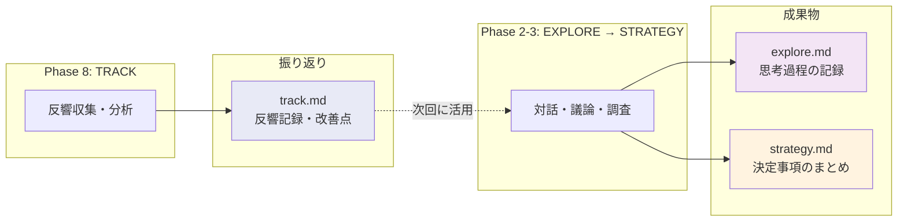

# ナレッジ投稿システム設計

> ステータス: **確定**
> 最終更新: 2026-02-09

---

## 1. システム概要

人間とAIが協力してナレッジ記事を継続的に作成・管理・投稿するための仕組み。



---

## 2. 対象媒体と投稿手段

| 媒体 | 特徴 | 読者層 | 投稿ツール | Skill |
|------|------|--------|------------|-------|
| **note** | ナラティブ寄り、幅広い読者 | 非エンジニア含む | scripts/post-note.py (API) | post-note |
| **Qiita** | 技術特化、Markdown完全対応 | エンジニア | qiita-cli | post-qiita |
| **Zenn** | 技術特化、frontmatter必須 | エンジニア | zenn-cli + git push | post-zenn |
| **WordPress** | SEO重視、HTML互換 | 検索流入 | WordPress REST API | post-wordpress |
| **社内Git** | 内部共有、制約なし | 社内メンバー | GitHub API (classlab-inc/document/Knowledge) | post-internal-git |
| **Slack** | 社内展開 | 社内メンバー | Slack MCP (#input) | post-slack |

---

## 3. 記事ライフサイクル



### 凡例

- 赤: 人間が主導
- 緑: AIが主導
- 青: 対話・共同作業

### 各Phaseの詳細

| Phase | 名称 | 主導 | やること |
|-------|------|------|----------|
| 1 | **INPUT** | 人間 | テーマ・素材・アイデアを持ち込む |
| 2 | **EXPLORE** | 共同 | テーマ深掘り・ペルソナ・競合調査・差別化・構成案 |
| 3 | **STRATEGY** | 共同 | 戦略を確定（目的・KPI・媒体選択・タイミング） |
| 4 | **DRAFT** | AI | マスター記事を執筆 |
| 5 | **REVIEW** | 人間 | レビュー → フィードバック → AIが修正（ループ） |
| 6 | **CONVERT** | AI | 選択した媒体向けにフォーマット変換 |
| 7 | **POST** | AI | MCPを使って各媒体に投稿（人間が最終承認） |
| 8 | **TRACK** | 共同 | 反響の収集・分析、次の記事へのフィードバック |

---

## 4. Phase 2: EXPLORE（ディープ探索）の内訳



| ステップ | 内容 | 成果物 |
|----------|------|--------|
| 2-1 | テーマは投稿に値するか？スコープは適切か？ | Go / No-Go判定 |
| 2-2 | 誰に届けるか？その人の課題・関心は？ | ペルソナ定義 |
| 2-3 | 既存記事との差別化ポイントは？ | 競合分析・ポジショニング |
| 2-4 | 読了後に読者が得るものは？ | コアメッセージ1文 |
| 2-5 | 見出し構成・各セクションで何を語るか | 構成案 |

---

## 5. Phase 8: TRACK（反響管理）の内訳



| 項目 | 内容 |
|------|------|
| 収集対象 | PV・いいね・ストック・コメント・シェア数 |
| 収集タイミング | 投稿後1週間・1ヶ月 |
| 分析観点 | どの媒体が反応良かったか、どのセクションが刺さったか |
| フィードバック先 | 次回のstrategy.mdに「前回の学び」として反映 |

---

## 6. プロジェクト構造

```
AI時代のエンジニアスキルセット/
├── CLAUDE.md                          ← AI向けプロジェクト規約
├── .ai/                               ← AIルール管理
│   ├── README.md
│   ├── dev/                           ← プロジェクト開発ルール
│   │   ├── structure.md                  ディレクトリ構造・命名規則
│   │   ├── commands.md                   カスタムコマンド設計方針
│   │   └── documentation.md              設計資料の作成ルール
│   └── content/                       ← 記事投稿ルール
│       ├── brainstorm/                   Phase 2: EXPLORE 時に参照
│       │   └── explore.md
│       ├── strategy/                     Phase 3: STRATEGY 時に参照
│       │   ├── strategy.md
│       │   └── template.md
│       ├── writing/                      Phase 4: DRAFT 時に参照
│       │   └── draft.md
│       ├── review/                       Phase 5: REVIEW 時に参照
│       │   └── review.md
│       ├── posting/                      Phase 6-7: CONVERT・POST 時に参照
│       │   ├── common.md
│       │   ├── images.md
│       │   ├── note.md
│       │   ├── qiita.md
│       │   ├── zenn.md
│       │   ├── wordpress.md
│       │   └── internal-git.md
│       └── track/                        Phase 8: TRACK 時に参照
│           └── track.md
├── .claude/commands/                  ← カスタムコマンド（9コマンド）
│   ├── new-article.md
│   ├── explore.md
│   ├── strategy.md
│   ├── draft.md
│   ├── review.md
│   ├── convert.md
│   ├── post.md
│   ├── track.md
│   └── add-rule.md
├── .claude/skills/                   ← スキル（サブエージェント実行、7スキル）
│   ├── post-wordpress/SKILL.md         WordPress REST API で投稿
│   ├── post-qiita/SKILL.md            qiita-cli で投稿
│   ├── post-zenn/SKILL.md             zenn-cli + git push で投稿
│   ├── post-note/SKILL.md             note.com API で投稿
│   ├── post-internal-git/SKILL.md     GitHub API で classlab-inc/document に投稿
│   ├── post-slack/SKILL.md            Slack MCP で社内展開
│   └── post-test/SKILL.md            全媒体テスト投稿（接続確認）
├── scripts/                          ← 投稿用スクリプト
│   └── post-note.py                     note.com API投稿
├── tests/                            ← テストスクリプト
├── docs/design/                    ← 設計ドキュメント
└── posts/
    ├── README.md                      ← 投稿ガイド・運用ルール
    ├── 001-ai-skillset/
    │   ├── strategy.md                ← 戦略（確定事項）
    │   ├── explore.md                 ← 探索記録（対話の過程）
    │   ├── master.md                  ← 原本（媒体非依存）
    │   ├── track.md                   ← 反響記録・振り返り
    │   ├── images.md                  ← 画像URL一覧（WPがマスター）
    │   └── platforms/
    │       ├── note.md
    │       ├── qiita.md
    │       ├── zenn.md
    │       ├── wordpress.md
    │       └── internal-git.md
    ├── 002-next-topic/
    │   └── ...
    └── ...
```

---

## 7. ルール管理（.ai/）

2つのドメインに分離して管理する。

```mermaid
flowchart TD
    subgraph dev[".ai/dev/ — プロジェクト開発ルール"]
        D1[structure.md]
        D2[commands.md]
        D3[documentation.md]
    end

    subgraph content[".ai/content/ — 記事投稿ルール"]
        P2[Phase 2: EXPLORE] -.->|読み込み| R1[brainstorm/]
        P3[Phase 3: STRATEGY] -.->|読み込み| R2[strategy/]
        P4[Phase 4: DRAFT] -.->|読み込み| R3[writing/]
        P5[Phase 5: REVIEW] -.->|読み込み| R4[review/]
        P6[Phase 6-7: CONVERT・POST] -.->|読み込み| R5[posting/]
        P8[Phase 8: TRACK] -.->|読み込み| R6[track/]
    end

    ADD[/add-rule コマンド] -->|追加・更新| dev & content

    style dev fill:#e8f5e9
    style content fill:#e3f2fd
    style ADD fill:#fff3e0
```

`/add-rule` コマンドでルールを追加する。コマンドはドメイン選択→ルール追加→違反チェック→改善まで自動実行する。

---

## 8. strategy.md と explore.md の役割



| ファイル | 役割 | 内容 |
|----------|------|------|
| **strategy.md** | 結論 | 目的・ペルソナ・コアメッセージ・差別化・媒体戦略・タイミング・KPI |
| **explore.md** | 過程 | 対話で出たアイデア・ボツ案・議論の経緯・調査結果 |
| **track.md** | 振り返り | 各媒体の反響データ・分析・次回への改善点 |
