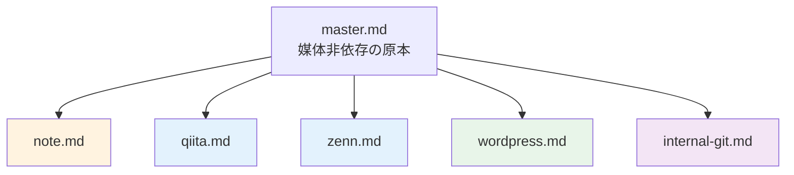
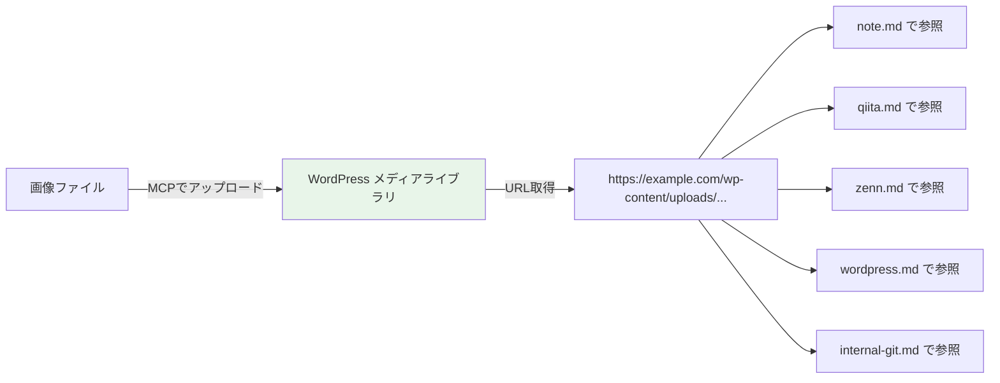
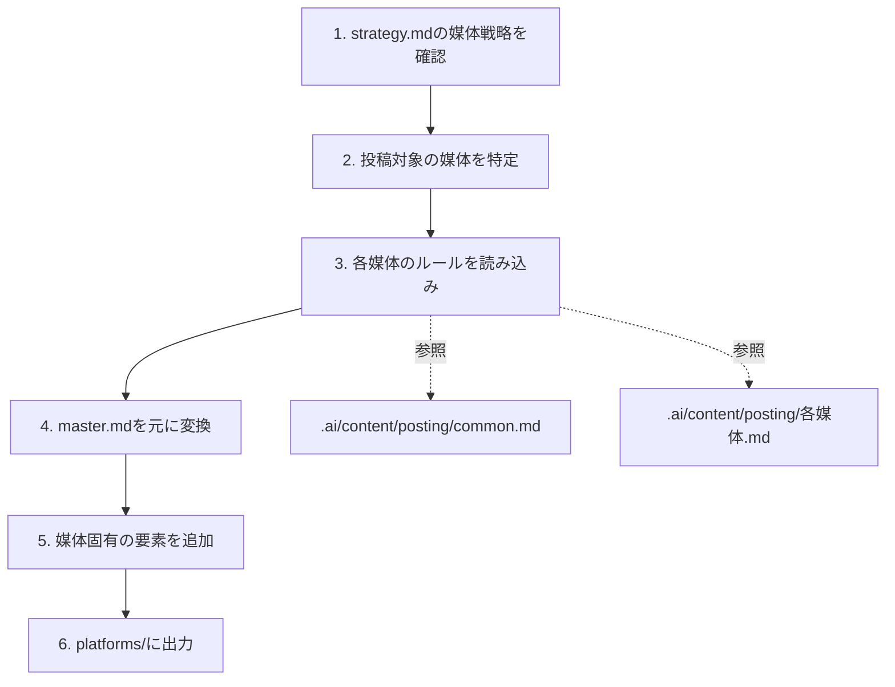

# 媒体変換ルール設計

> ステータス: **確定**
> 最終更新: 2026-02-09

---

## 1. 変換の全体方針

master.md（原本）を起点に、各媒体向けにフォーマット・トーン・構造を変換する。



---

## 2. 媒体別の変換マトリクス

### フォーマット対応

| 要素 | master.md | note | Qiita | Zenn | WordPress | 社内Git |
|------|-----------|------|-------|------|-----------|---------|
| Mermaid図 | そのまま | テキスト図解に変換 | そのまま | そのまま | そのまま（WP側で対応） | そのまま |
| テーブル | そのまま | そのまま | そのまま | そのまま | そのまま | そのまま |
| コードブロック | そのまま | そのまま | そのまま | そのまま | そのまま | そのまま |
| 画像 | パス参照 | WPのURL参照 | WPのURL参照 | WPのURL参照 | MCPでアップロード（原本） | WPのURL参照 |
| frontmatter | なし | なし | なし | YAML追加 | SEOコメント追加 | なし |
| 目次 | あり | 任意 | 自動生成 | 自動生成 | あり | あり |

### トーン

| 媒体 | トーン | 特徴 |
|------|--------|------|
| note | エッセイ調 | 語りかけるような文体、体験・ストーリー性を加える |
| Qiita | 技術記事調 | ですます体、客観的、根拠を添える |
| Zenn | 技術記事調 | ですます体、Qiitaに近いがZenn独自記法を活用 |
| WordPress | SEO記事調 | ですます体、検索意図を意識した見出し |
| 社内Git | フラット技術文書調 | である体OK、社内コンテキスト前提 |

### 構造の調整

| 媒体 | 冒頭 | 末尾 | 固有の追加要素 |
|------|------|------|---------------|
| note | リード文（課題提示＋得られること） | まとめ＋CTA | なし |
| Qiita | 対象読者＋得られること | 参考リンク | タグ（最大5つ） |
| Zenn | 概要 | 参考リンク | frontmatter、メッセージボックス（:::message） |
| WordPress | リード文（SEO意識） | CTA＋関連記事リンク | SEOメタ情報、カテゴリ・タグ |
| 社内Git | そのまま | そのまま | 社内向け補足コメント |

---

## 3. 画像の管理フロー

画像はWordPressをマスターストレージとして一元管理する。



| ステップ | やること |
|----------|----------|
| 1 | 画像をMCPでWordPressのメディアライブラリにアップロード |
| 2 | アップロード後のURLを取得 |
| 3 | 記事ディレクトリの `images.md` にURL一覧を記録 |
| 4 | 全媒体の記事でそのURLを参照する |

### URL管理ファイル

各記事ディレクトリに `images.md` を配置し、画像URLを一覧管理する。

```markdown
# 画像一覧

| # | ファイル名 | 用途 | WordPress URL |
|---|-----------|------|---------------|
| 1 | ai-skillset-flow.png | 全体フロー図 | https://example.com/wp-content/uploads/... |
```

### 命名規則

- ファイル名: `記事slug-内容.拡張子`（例: `ai-skillset-flow.png`）
- 英字小文字・ハイフン区切り

詳細ルール: `.ai/content/posting/images.md`

---

## 4. Mermaid図の変換ルール

Mermaid非対応媒体（note）では以下の方式で変換する。

### フローチャート → インデント付きリスト

```
変換前（Mermaid）:
  A → B → C → D

変換後（テキスト）:
  1. A
     ↓
  2. B
     ↓
  3. C
     ↓
  4. D
```

### マインドマップ → ネスト箇条書き

```
変換前（Mermaid）:
  root
    ├── 子1
    │   ├── 孫1-1
    │   └── 孫1-2
    └── 子2

変換後（テキスト）:
  - **ルート**
    - **子1**
      - 孫1-1
      - 孫1-2
    - **子2**
```

### グラフ/マトリクス → テーブル

```
変換前（Mermaid）:
  graph with subgroups

変換後（テキスト）:
  | カテゴリ | 項目1 | 項目2 |
  |----------|-------|-------|
  | グループA | ... | ... |
```

---

## 5. 変換の実行手順



| ステップ | やること |
|----------|----------|
| 1 | strategy.md の「媒体戦略」セクションを読み、どの媒体に投稿するか確認 |
| 2 | 投稿する媒体のリストを確定 |
| 3 | `.ai/content/posting/common.md` + 各媒体ルールを読み込み |
| 4 | master.md をベースに、トーン・フォーマット・構造を変換 |
| 5 | frontmatter、タグ、SEO情報など媒体固有の要素を追加 |
| 6 | `platforms/{媒体名}.md` として出力 |
