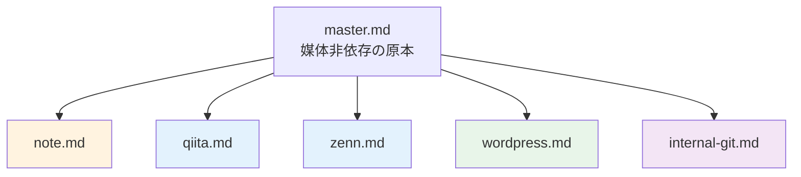
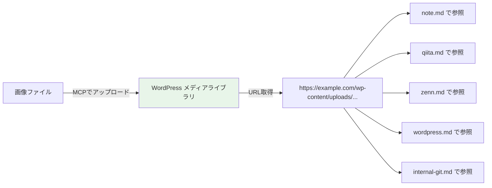
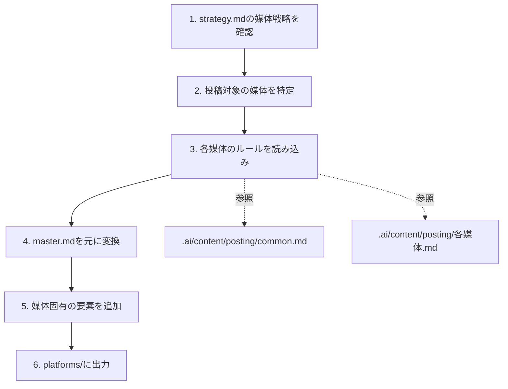
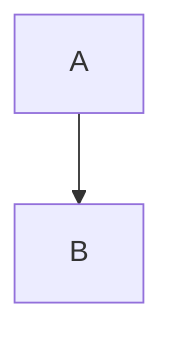

# 媒体変換ルール設計

> ステータス: **確定**
> 最終更新: 2026-02-16

---

## 1. 変換の全体方針

master.md（原本）を起点に、各媒体向けにフォーマット・トーン・構造を変換する。



---

## 2. 媒体別の変換マトリクス

### フォーマット対応

| 要素 | master.md | note | Qiita | Zenn | WordPress | 社内Git |
|------|-----------|------|-------|------|-----------|---------|
| Mermaid図 | そのまま | テキスト図解に変換 | そのまま | そのまま | `<div class="mermaid">` で変換 | そのまま |
| テーブル | そのまま | そのまま | そのまま | そのまま | HTMLテーブル + Gutenbergブロック | そのまま |
| コードブロック | そのまま | そのまま | そのまま | そのまま | `<pre class="language-xxx" data-lang="Xxx">` | そのまま |
| 画像 | パス参照 | WPのURL参照 | WPのURL参照 | WPのURL参照 | MCPでアップロード（原本） | WPのURL参照 |
| frontmatter | なし | なし | なし | YAML追加 | SEOコメント追加 | なし |
| 目次 | あり | 任意 | 自動生成 | 自動生成 | テーマ自動生成（H2/H3、スクロール追従） | あり |
| 注釈ボックス | `> **Note**:` 等 | テキスト変換 | そのまま | `:::message` | `[note]`/`[warning]`/`[tip]`/`[info]` | そのまま |
| 手順ガイド | 番号付きリスト | そのまま | そのまま | そのまま | `[steps]`+`[step]` | そのまま |
| タイムライン | リスト | テキスト変換 | そのまま | そのまま | `[timeline]`+`[timeline_item]` | そのまま |
| FAQ/折りたたみ | `<details>` | テキスト変換 | そのまま | `:::details` | `[accordion]`+`[accordion_item]` | そのまま |

### トーン

| 媒体 | トーン | 特徴 |
|------|--------|------|
| note | エッセイ調 | 語りかけるような文体、体験・ストーリー性を加える |
| Qiita | 技術記事調 | ですます体、客観的、根拠を添える |
| Zenn | 技術記事調 | ですます体、Qiitaに近いがZenn独自記法を活用 |
| WordPress | SEO記事調 | ですます体、検索意図を意識した見出し |
| 社内Git | フラット技術文書調 | である体OK、社内コンテキスト前提 |

### 構造の調整

| 媒体 | 冒頭 | 末尾 | 固有の追加要素 |
|------|------|------|---------------|
| note | リード文（課題提示＋得られること） | まとめ＋CTA | なし |
| Qiita | 対象読者＋得られること | 参考リンク | タグ（最大5つ） |
| Zenn | 概要 | 参考リンク | frontmatter、メッセージボックス（:::message） |
| WordPress | リード文（SEO意識） | CTA＋関連記事リンク | SEOメタ情報、カテゴリ・タグ、ショートコード（engineer-blog テーマ） |
| 社内Git | そのまま | そのまま | 社内向け補足コメント |

---

## 3. 画像の管理フロー

画像はWordPressをマスターストレージとして一元管理する。



| ステップ | やること |
|----------|----------|
| 1 | 画像をMCPでWordPressのメディアライブラリにアップロード |
| 2 | アップロード後のURLを取得 |
| 3 | 記事ディレクトリの `images.md` にURL一覧を記録 |
| 4 | 全媒体の記事でそのURLを参照する |

### URL管理ファイル

各記事ディレクトリに `images.md` を配置し、画像URLを一覧管理する。

```markdown
# 画像一覧

| # | ファイル名 | 用途 | WordPress URL |
|---|-----------|------|---------------|
| 1 | ai-skillset-flow.png | 全体フロー図 | https://example.com/wp-content/uploads/... |
```

### 命名規則

- ファイル名: `記事slug-内容.拡張子`（例: `ai-skillset-flow.png`）
- 英字小文字・ハイフン区切り

詳細ルール: `.ai/content/posting/images.md`

---

## 4. Mermaid図の変換ルール

Mermaid非対応媒体（note）では以下の方式で変換する。

### フローチャート → インデント付きリスト

```
変換前（Mermaid）:
  A → B → C → D

変換後（テキスト）:
  1. A
     ↓
  2. B
     ↓
  3. C
     ↓
  4. D
```

### マインドマップ → ネスト箇条書き

```
変換前（Mermaid）:
  root
    ├── 子1
    │   ├── 孫1-1
    │   └── 孫1-2
    └── 子2

変換後（テキスト）:
  - **ルート**
    - **子1**
      - 孫1-1
      - 孫1-2
    - **子2**
```

### グラフ/マトリクス → テーブル

```
変換前（Mermaid）:
  graph with subgroups

変換後（テキスト）:
  | カテゴリ | 項目1 | 項目2 |
  |----------|-------|-------|
  | グループA | ... | ... |
```

---

## 5. 変換の実行手順



| ステップ | やること |
|----------|----------|
| 1 | strategy.md の「媒体戦略」セクションを読み、どの媒体に投稿するか確認 |
| 2 | 投稿する媒体のリストを確定 |
| 3 | `.ai/content/posting/common.md` + 各媒体ルールを読み込み |
| 4 | master.md をベースに、トーン・フォーマット・構造を変換 |
| 5 | frontmatter、タグ、SEO情報など媒体固有の要素を追加 |
| 6 | `platforms/{媒体名}.md` として出力 |

---

## 6. WordPress ショートコード変換ルール

WordPress テーマ「engineer-blog」は独自ショートコードを備えており、master.md の記法からリッチなコンテンツに変換する。

詳細リファレンス: `docs/design/wp-shortcode-reference.md`

### master.md → WordPress 変換マッピング

| master.md の記法 | WordPress 変換先 |
|-----------------|-----------------|
| `> 引用テキスト` | `[quote]` ショートコード（出典あり）または `<blockquote>`（出典なし） |
| `> **Note**: ...` / `> ⚠️ ...` | `[note]` / `[warning]` ショートコード |
| `> 💡 ...` / `> ℹ️ ...` | `[tip]` / `[info]` ショートコード |
| `==ハイライト==` | `[marker]テキスト[/marker]` |
| 手順（1. 2. 3.）+ 説明付き | `[steps]` + `[step]` ショートコード |
| 年表・時系列データ | `[timeline]` + `[timeline_item]` ショートコード |
| FAQ / 折りたたみ | `[accordion]` + `[accordion_item]` ショートコード |
| 外部リンク（参考記事） | `[link_card]` ショートコード |
| Amazon 書籍紹介 | `[amazon]` ショートコード |
| A vs B 比較表 | `[comparison]` ショートコード |
| 2〜4列レイアウト | `[columns]` + `[column]` ショートコード |
| `**太字キーワード**` | そのまま `<strong>` または `[badge]` |
| コードブロック `` ```lang `` | `<pre class="language-lang" data-lang="Lang"><code>...</code></pre>` |
| Mermaid `` ```mermaid `` | `<div class="mermaid">...</div>` |

### Gutenberg ブロック記法

WordPress 投稿では Gutenberg ブロックコメントでコンテンツを構造化する。

```html
<!-- wp:paragraph -->
<p>段落テキスト</p>
<!-- /wp:paragraph -->

<!-- wp:heading -->
<h2>見出し</h2>
<!-- /wp:heading -->

<!-- wp:code -->
<pre class="wp-block-code"><code>コード</code></pre>
<!-- /wp:code -->
```

**重要**: ショートコードはブロックの外（トップレベル）に直接記述する。`<!-- wp:paragraph -->` の中に入れない。

### ショートコード一覧（11種）

| # | ショートコード | 用途 | 種別 |
|---|--------------|------|------|
| 1 | `[note]` / `[warning]` / `[tip]` / `[info]` | 注釈ボックス（4色） | ブロック |
| 2 | `[quote]` | 出典付き引用 | ブロック |
| 3 | `[timeline]` + `[timeline_item]` | タイムライン | ブロック |
| 4 | `[steps]` + `[step]` | ステップガイド | ブロック |
| 5 | `[link_card]` | リンクカード | ブロック |
| 6 | `[amazon]` | Amazonリンク | ブロック |
| 7 | `[badge]` | バッジ | インライン |
| 8 | `[marker]` | マーカー/ハイライト | インライン |
| 9 | `[accordion]` + `[accordion_item]` | 折りたたみ | ブロック |
| 10 | `[columns]` + `[column]` | カラムレイアウト | ブロック |
| 11 | `[comparison]` | 比較テーブル | ブロック |

---

## 7. WordPress コードハイライト（Prism.js 12言語）

engineer-blog テーマは Prism.js によるシンタックスハイライトに対応。

### 変換ルール

master.md のコードブロック:
````
```javascript
const hello = "world";
```
````

wordpress.md に変換:
```html
<pre class="language-javascript" data-lang="JavaScript"><code>
const hello = "world";
</code></pre>
```

### 対応言語

| 言語 | CSS クラス | `data-lang` |
|------|-----------|------------|
| JavaScript | `language-javascript` | `JavaScript` |
| TypeScript | `language-typescript` | `TypeScript` |
| Python | `language-python` | `Python` |
| PHP | `language-php` | `PHP` |
| Bash | `language-bash` | `Bash` |
| Go | `language-go` | `Go` |
| Rust | `language-rust` | `Rust` |
| SQL | `language-sql` | `SQL` |
| JSON | `language-json` | `JSON` |
| YAML | `language-yaml` | `YAML` |
| Diff | `language-diff` | `Diff` |
| Markdown | `language-markdown` | `Markdown` |

---

## 8. WordPress Mermaid.js 図解（4種類）

テーマは Mermaid.js CDN を読み込み、`<div class="mermaid">` 内のコードを自動レンダリングする。

### 変換ルール

master.md の Mermaid ブロック:
````

````

wordpress.md に変換:
```html
<div class="mermaid">
flowchart TD
  A --> B
</div>
```

### 対応ダイアグラム

| 種類 | Mermaid記法 | 用途 |
|------|------------|------|
| フローチャート | `flowchart TD` / `graph TD` | 処理フロー、意思決定 |
| シーケンス図 | `sequenceDiagram` | API呼び出し、通信フロー |
| ガントチャート | `gantt` | スケジュール、タイムライン |
| クラス図 | `classDiagram` | データモデル、クラス構造 |

---

## 9. WordPress HTMLスタイル

engineer-blog テーマの CSS が以下のHTML要素をスタイリング:

| HTML要素 | テーマスタイル |
|---------|-------------|
| `<h2>` | 紫→青グラデーション左ボーダー + 大きめフォント |
| `<h3>` | 緑の左ボーダー |
| `<h4>` | 太字（ボーダーなし） |
| `<table>` | 角丸 + シャドウ + ヘッダーグラデーション + ホバーハイライト |
| `<blockquote>` | グラデーション左ボーダー + 薄い背景色 + イタリック体 |
| `<code>` (inline) | 紫テキスト + グラデーション背景 |
| `<pre>` + `<code>` | ダーク背景 + 角丸 + シャドウ + 言語ラベル |
| `` | 角丸（8px）+ 中央寄せ |
| `<ul>` / `<ol>` | 適切な余白とインデント |
| `<hr>` | スタイリング済み区切り線 |

---

## 10. WordPress テーマ自動機能

以下はテーマが自動提供する。変換時の対応は不要（SEOメタ情報の設定のみ必要）。

| 機能 | 説明 |
|------|------|
| 目次（TOC） | H2/H3から自動生成、スクロール追従 |
| 読了時間 | 日本語600文字/分で自動計算 |
| 閲覧数 | ページビューを自動カウント |
| いいね機能 | 記事ごとのいいねボタン + サイドバーランキング |
| リーディングプログレスバー | 読み進め具合をページ上部に表示 |
| パンくずリスト | カテゴリに基づき自動生成 |
| シェアボタン | X / Facebook / はてブ / URLコピー |
| 著者プロフィール | WPユーザー情報から自動表示 |
| 関連記事 | 同カテゴリ・タグから自動抽出 |
| クロスプラットフォームCTA | note/Qiita/Zennへの誘導 |
| OGP/SEO メタタグ | 構造化データ自動出力 |
| GA4イベント | 読了率・CTAクリック・コードコピー |
| Mermaidレンダリング | `<div class="mermaid">` を図解に自動変換 |
| Prism.js ハイライト | 12言語のシンタックスハイライト |
| コード言語ラベル | `data-lang` 属性で右上にラベル表示 |

詳細リファレンス: `docs/design/wp-shortcode-reference.md`
