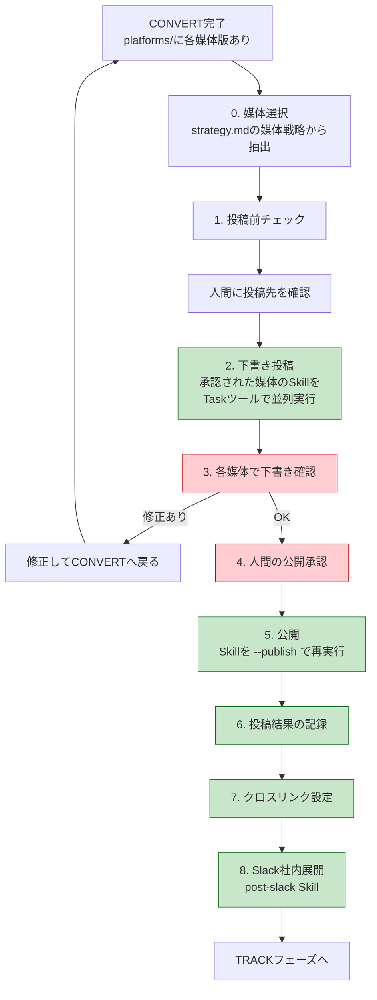
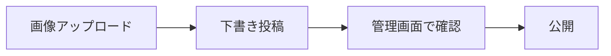
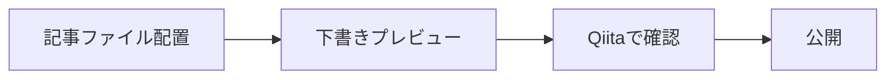
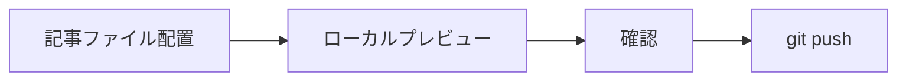
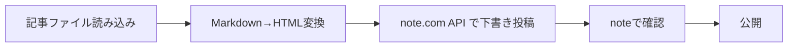
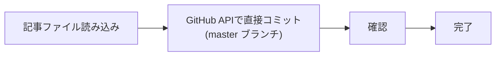
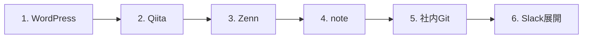

# 投稿フロー詳細設計

> ステータス: **確定**
> 最終更新: 2026-02-09

---

## 1. 投稿ツール一覧

| 媒体 | ツール | 種別 | Skill |
|------|--------|------|-------|
| note | scripts/post-note.py（API投稿） | API | post-note |
| Qiita | [qiita-cli](https://github.com/increments/qiita-cli) | CLI | post-qiita |
| Zenn | [zenn-cli](https://zenn.dev/zenn/articles/install-zenn-cli) + git push | CLI | post-zenn |
| WordPress | WordPress REST API | API | post-wordpress |
| 社内Git | GitHub API (classlab-inc/document/Knowledge) | API | post-internal-git |
| 社内展開 | Slack MCP (#input C08ACUZ7Z1U) | MCP | post-slack |

### MCP サーバー構成（.mcp.json）

| サーバー名 | 用途 |
|-----------|------|
| wordpress | WordPress REST API 接続 |
| github | thirai-classlab org（Zenn用 knowledges リポジトリ等） |
| github-internal | classlab-inc org（社内Git: document/Knowledge） |
| slack | Slack MCP（#input チャンネル） |

---

## 2. 全体フロー



---

## 3. 投稿前チェック

| # | チェック項目 | 確認内容 |
|---|------------|----------|
| 1 | strategy.md の媒体戦略 | 投稿対象の媒体が明確か |
| 2 | platforms/ のファイル存在 | 対象媒体のファイルが揃っているか |
| 3 | 画像URL | images.md のURLが有効か |
| 4 | 媒体固有フォーマット | frontmatter(Zenn)、SEOコメント(WP)、タグ(Qiita)が設定済みか |
| 5 | CLIツールの準備 | 各CLIがインストール・認証済みか |

---

## 4. 媒体別投稿手順

### WordPress（wordpress-mcp）



| ステップ | 手段 | 操作内容 |
|----------|------|----------|
| 画像アップロード | wordpress-mcp | メディアライブラリに画像をアップロード、URL取得 |
| 下書き投稿 | wordpress-mcp | platforms/wordpress.md を下書きステータスで投稿 |
| 確認 | 人間 | WP管理画面のプレビューで表示確認 |
| SEO設定 | wordpress-mcp | カテゴリ・タグ・メタ情報を設定 |
| 公開 | wordpress-mcp | 承認後にステータスを公開に変更 |

### Qiita（qiita-cli）



| ステップ | 手段 | 操作内容 |
|----------|------|----------|
| ファイル配置 | Bash | qiita-cli のディレクトリに platforms/qiita.md を配置 |
| 下書きプレビュー | Bash | `npx qiita preview` で下書きプレビュー |
| 確認 | 人間 | ブラウザでプレビュー確認 |
| 公開 | Bash | `npx qiita publish` で公開（承認後） |

### Zenn（zenn-cli）



| ステップ | 手段 | 操作内容 |
|----------|------|----------|
| ファイル配置 | Bash | articles/ に frontmatter付きmdファイルを配置 |
| プレビュー | Bash | `npx zenn preview` でローカルプレビュー |
| 確認 | 人間 | ブラウザでプレビュー確認 |
| 公開 | Bash | git add → git commit → git push（承認後。published: true で公開） |

### note（API投稿）



| ステップ | 手段 | 操作内容 |
|----------|------|----------|
| ファイル読み込み | Read | platforms/note.md の内容を取得 |
| 下書き投稿 | scripts/post-note.py | Markdown→HTML変換 → note.com非公式APIで下書き作成 |
| 確認 | 人間 | noteの下書きプレビューで確認 |
| 公開 | scripts/post-note.py | 承認後にAPIで公開ステータスに変更 |

note.comには公式APIがないため、非公式APIをCookie認証で利用する。note-cli (JY8752/note-cli) はローカルでの記事管理・OGP画像生成に使用。

### 社内Git（GitHub API — classlab-inc/document）



| ステップ | 手段 | 操作内容 |
|----------|------|----------|
| ファイル読み込み | Read | platforms/internal-git.md の内容を取得 |
| コミット | GitHub API (github-internal PAT) | `classlab-inc/document/Knowledge/{slug}.md` に直接コミット（master ブランチ） |
| 確認 | 人間 | GitHub上で内容を確認 |
| 更新 | GitHub API | 既存ファイルがある場合はSHAを取得して上書き |

Fine-grained PAT の制約（Resource owner は1つのみ）により、`github-internal` として個別のPATを設定。

---

## 5. 投稿順序



| 順序 | 媒体 | 理由 |
|------|------|------|
| 1 | WordPress | 画像アップロードのマスター。SEOインデックスを先行させる |
| 2 | Qiita | 技術コミュニティへの早期露出 |
| 3 | Zenn | git push後の反映待ち時間を考慮 |
| 4 | note | クロスリンクを含めて投稿 |
| 5 | 社内Git | 外部投稿のURLが揃ってからクロスリンク付きで投稿 |
| 6 | Slack | 全URLが揃った状態で社内に展開 |

---

## 6. 投稿結果の記録

### track.md への記録

```markdown
## 投稿記録

| 媒体 | 投稿日 | URL | ステータス |
|------|--------|-----|-----------|
| WordPress | 2026-02-09 | https://example.com/... | 公開済み |
| Qiita | 2026-02-09 | https://qiita.com/... | 公開済み |
| Zenn | 2026-02-09 | https://zenn.dev/... | 公開済み |
| note | 2026-02-09 | https://note.com/... | 公開済み |
| 社内Git | 2026-02-09 | https://github.com/... | マージ済み |
```

### strategy.md のステータス更新

- 「確定」→「投稿済み」に変更

---

## 7. クロスリンク設定

複数媒体に投稿した場合、各記事の末尾に他媒体へのリンクを追記する。

```markdown
---
この記事は以下の媒体でも公開しています:
- [note版](https://note.com/...)
- [Qiita版](https://qiita.com/...)
- [Zenn版](https://zenn.dev/...)
- [WordPress版](https://example.com/...)
```

---

## 8. Slack社内展開（post-slack Skill）

全媒体への投稿完了後、`post-slack` Skill で社内に展開する。

| 項目 | 内容 |
|------|------|
| 投稿先 | #input チャンネル (C08ACUZ7Z1U) |
| ツール | Slack MCP (`mcp__slack__conversations_add_message`) |
| 内容 | 記事タイトル + コアメッセージ + 各媒体URL一覧 |
| タイミング | 全媒体の公開完了後 |

### メッセージテンプレート

```markdown
## 新しい記事を公開しました

**{記事タイトル}**

{コアメッセージ}

### 各媒体リンク
- note: {url}
- Qiita: {url}
- Zenn: {url}
- WordPress: {url}
- 社内Git: {url}

フィードバックお待ちしています！
```
