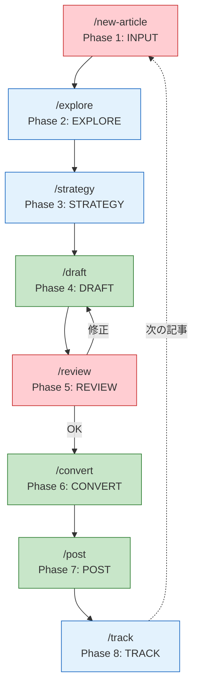
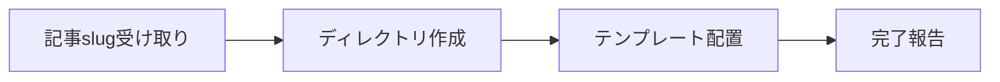
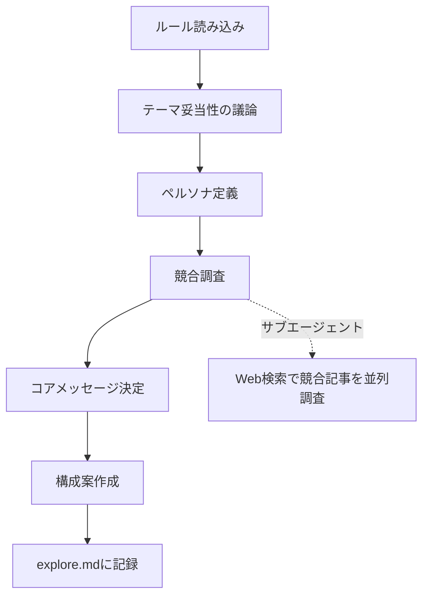
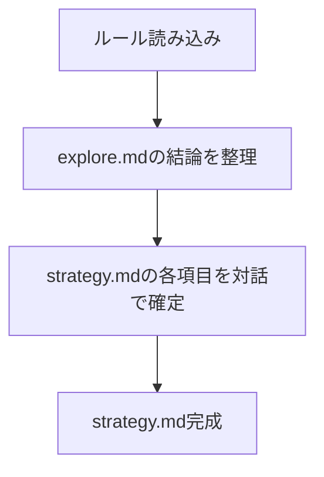
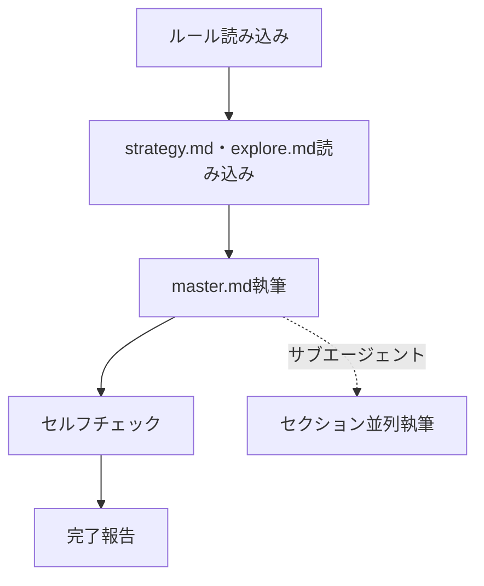
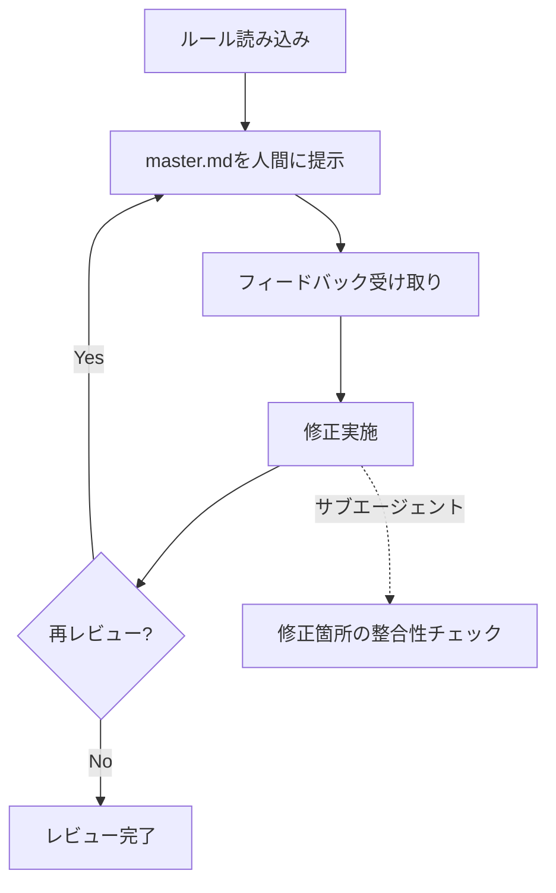
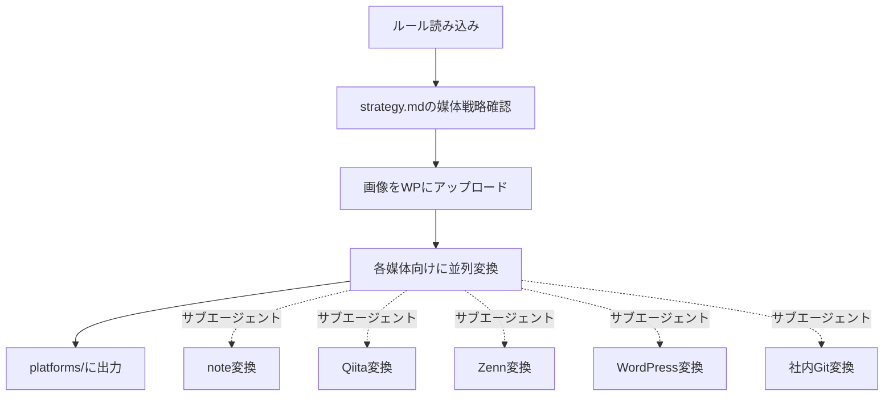
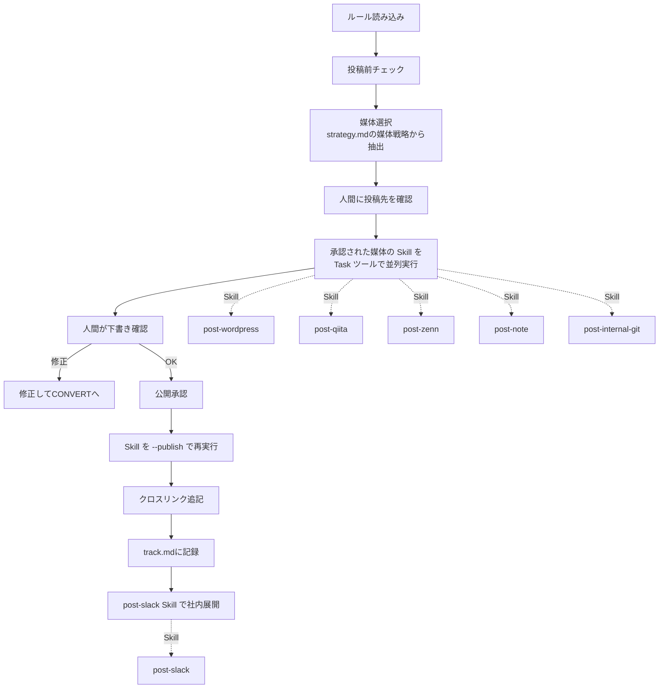
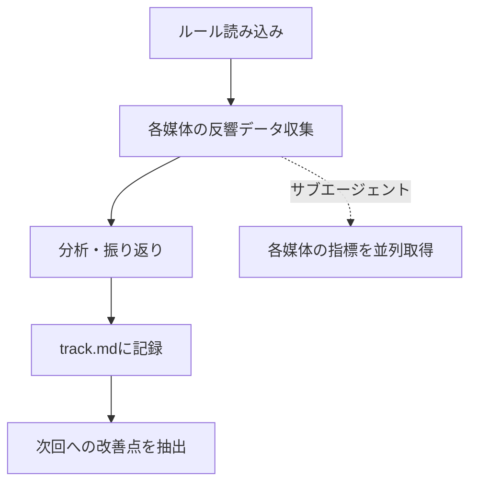
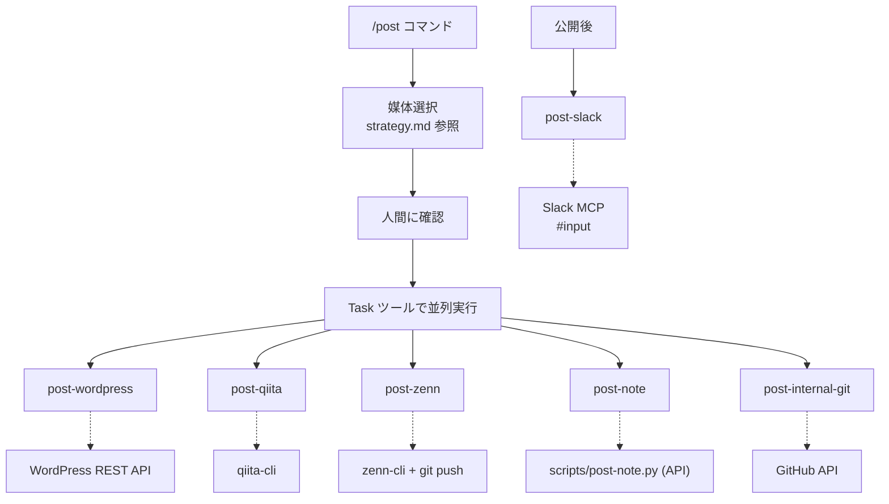

# 全体ステップ見直し & コマンド設計

> ステータス: **確定**
> 最終更新: 2026-02-09

---

## 1. 全体ステップ（見直し後）

各Phaseを専用コマンドで実行する。コマンドはサブエージェントを活用して並列・自律的に処理する。



---

## 2. コマンド一覧

| コマンド | Phase | 主導 | 概要 |
|----------|-------|------|------|
| `/new-article` | 1: INPUT | 人間 | 新しい記事ディレクトリを作成し、テンプレートを配置 |
| `/explore` | 2: EXPLORE | 共同 | テーマの深掘り・ペルソナ・競合調査・構成案 |
| `/strategy` | 3: STRATEGY | 共同 | 戦略を確定し strategy.md を完成 |
| `/draft` | 4: DRAFT | AI | master.md を執筆 |
| `/review` | 5: REVIEW | 人間 | レビュー・フィードバック・修正ループ |
| `/convert` | 6: CONVERT | AI | 各媒体向けにフォーマット変換 |
| `/post` | 7: POST | AI | 各媒体に下書き→確認→公開→Slack展開 |
| `/track` | 8: TRACK | 共同 | 反響収集・分析・振り返り |
| `/add-rule` | - | 共同 | ルール追加・違反チェック・改善（既存） |

---

## 3. 各コマンドの詳細設計

### /new-article



| 項目 | 内容 |
|------|------|
| 引数 | `$ARGUMENTS` = 記事のslug（例: `ai-skillset`） |
| 処理 | 次の連番を取得し `posts/{NNN}-{slug}/` を作成 |
| 配置ファイル | strategy.md（テンプレート）, explore.md（空）, images.md（空） |
| サブエージェント | 不要（単純なファイル操作） |
| ルール参照 | `.ai/dev/structure.md` |

### /explore



| 項目 | 内容 |
|------|------|
| 引数 | `$ARGUMENTS` = 記事ディレクトリパス or 記事番号 |
| 前提 | `/new-article` で作成済みのディレクトリが存在 |
| 処理 | 対話形式でディープ探索を実行 |
| サブエージェント | 競合記事のWeb検索・分析を並列実行 |
| ルール参照 | `.ai/content/brainstorm/explore.md` |
| 成果物 | explore.md に対話記録を保存 |

### /strategy



| 項目 | 内容 |
|------|------|
| 引数 | `$ARGUMENTS` = 記事ディレクトリパス or 記事番号 |
| 前提 | explore.md が作成済み |
| 処理 | explore.md の結論をもとに、strategy.md の各項目を対話で確定 |
| サブエージェント | 不要（対話中心） |
| ルール参照 | `.ai/content/strategy/strategy.md`, `.ai/content/strategy/template.md` |
| 成果物 | strategy.md（ステータス: 確定） |

### /draft



| 項目 | 内容 |
|------|------|
| 引数 | `$ARGUMENTS` = 記事ディレクトリパス or 記事番号 |
| 前提 | strategy.md がステータス「確定」 |
| 処理 | strategy.md の構成案に従い master.md を執筆 |
| サブエージェント | 大きな記事の場合、セクションを分割して並列執筆 |
| ルール参照 | `.ai/content/writing/draft.md` |
| 成果物 | master.md |

### /review



| 項目 | 内容 |
|------|------|
| 引数 | `$ARGUMENTS` = 記事ディレクトリパス or 記事番号 |
| 前提 | master.md が作成済み |
| 処理 | 人間のフィードバックを受けて修正ループ |
| サブエージェント | 修正後のstrategy.md との整合性チェック |
| ルール参照 | `.ai/content/review/review.md` |
| 成果物 | master.md（レビュー済み） |

### /convert



| 項目 | 内容 |
|------|------|
| 引数 | `$ARGUMENTS` = 記事ディレクトリパス or 記事番号 |
| 前提 | master.md がレビュー済み |
| 処理 | master.md を各媒体向けに変換 |
| サブエージェント | 各媒体への変換を並列実行（5並列） |
| ルール参照 | `.ai/content/posting/common.md`, `.ai/content/posting/{各媒体}.md`, `.ai/content/posting/images.md` |
| 成果物 | platforms/ 配下に各媒体版、images.md |

### /post



| 項目 | 内容 |
|------|------|
| 引数 | `$ARGUMENTS` = 記事ディレクトリパス or 記事番号 |
| 前提 | platforms/ に変換済みファイルが揃っている |
| 処理 | 媒体選択→下書き投稿→確認→公開→記録→Slack展開 |
| 実行方式 | 各媒体の Skill を **Task ツールで並列実行**（`context: fork` のサブエージェント） |
| ルール参照 | `.ai/content/posting/common.md` |
| 投稿順序 | WordPress（画像マスター）→ 他媒体並列 → Slack展開 |
| 成果物 | track.md（投稿記録）、strategy.md（ステータス: 投稿済み） |

### /track



| 項目 | 内容 |
|------|------|
| 引数 | `$ARGUMENTS` = 記事ディレクトリパス or 記事番号 |
| 前提 | 投稿済み（track.md に投稿記録あり） |
| 処理 | 反響データの収集・分析・振り返り |
| サブエージェント | 各媒体のPV・いいね等を並列取得 |
| ルール参照 | `.ai/content/track/track.md` |
| 成果物 | track.md（反響記録・改善点） |

---

## 4. コマンドの共通仕様

### 引数の解決

全コマンド共通で、引数から記事ディレクトリを解決する。

```
入力パターン:
  /command 001          → posts/001-*/
  /command ai-skillset  → posts/*-ai-skillset/
  /command              → 最新の記事ディレクトリ（番号が最大のもの）
```

### ルール読み込み

各コマンドは実行開始時に対応する `.ai/` ルールを自動で読み込む。

### サブエージェント活用の方針

| パターン | 使い方 |
|----------|--------|
| 並列検索 | 競合記事のWeb検索を複数クエリで同時実行 |
| 並列変換 | 5媒体への変換を同時実行 |
| 並列投稿 | 各 Skill を Task ツールで同時実行 |
| 並列取得 | 各媒体の反響データを同時収集 |
| 整合性チェック | 修正後のstrategy.mdとの一致確認 |

---

## 5. Skills（サブエージェント）

`/post` コマンドから Task ツールで並列呼び出しされる投稿スキル。各スキルは `.claude/skills/{name}/SKILL.md` に定義され、`context: fork` でサブエージェントとして実行される。

### Skills 一覧



| Skill | 説明 | 投稿手段 | context |
|-------|------|----------|---------|
| `post-wordpress` | WordPress REST API で下書き/公開投稿 | curl (REST API) | fork |
| `post-qiita` | qiita-cli で限定公開/公開投稿 | `npx qiita publish` | fork |
| `post-zenn` | published: false/true で git push | zenn-cli + git | fork |
| `post-note` | API で下書き/公開投稿 | scripts/post-note.py | fork |
| `post-internal-git` | classlab-inc/document/Knowledge にコミット | GitHub API (github-internal PAT) | fork |
| `post-slack` | #input チャンネルに記事情報を投稿 | Slack MCP | fork |
| `post-test` | 全媒体にテスト投稿（接続確認） | 上記全て | fork |

### Skill の実行フロー

1. `/post` コマンドが strategy.md から投稿対象媒体を取得
2. 人間に投稿先を確認（チェックリスト表示）
3. 承認された媒体の Skill を Task ツールで並列実行
4. 各 Skill は SKILL.md の手順に従い、記事ディレクトリパスを受け取って投稿
5. 結果（ステータス + URL）を `/post` コマンドに返す
6. 全結果を集約して人間に報告
7. 公開承認後、各 Skill を `--publish` 引数で再実行
8. `post-slack` Skill で社内展開
