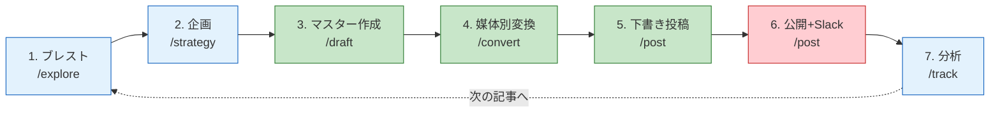
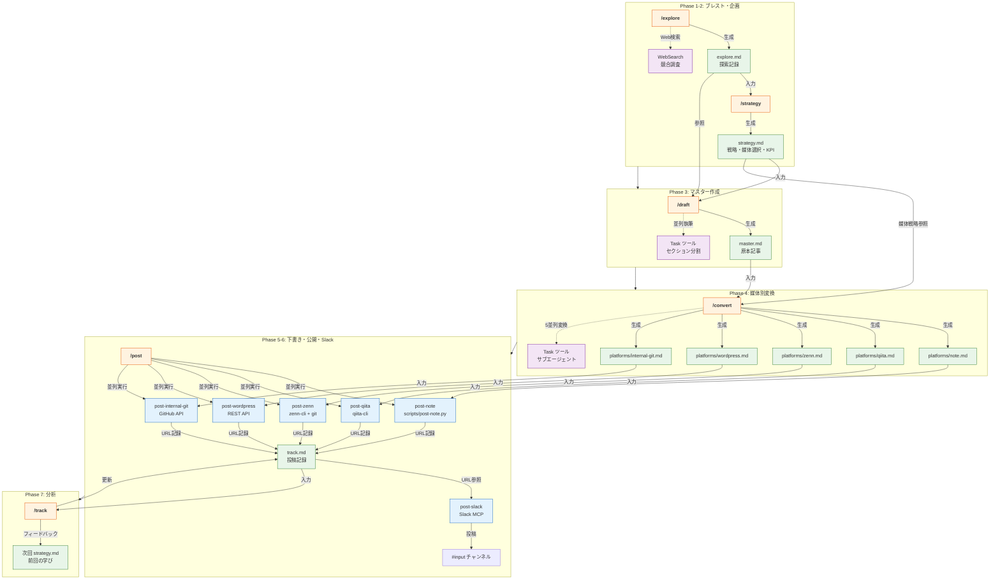
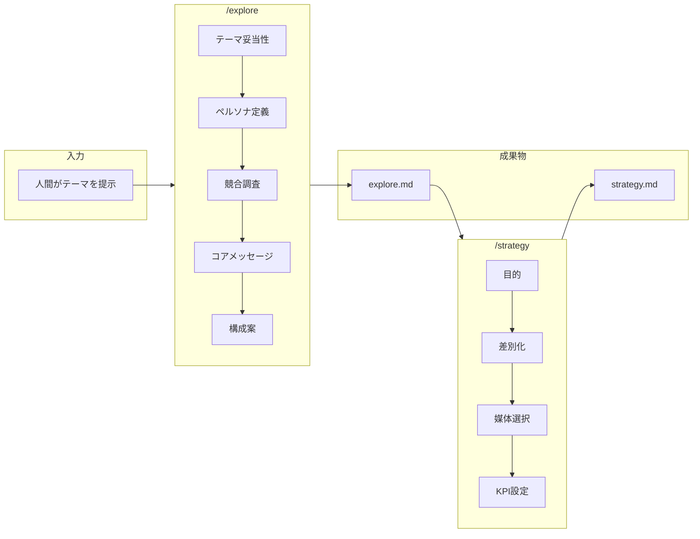
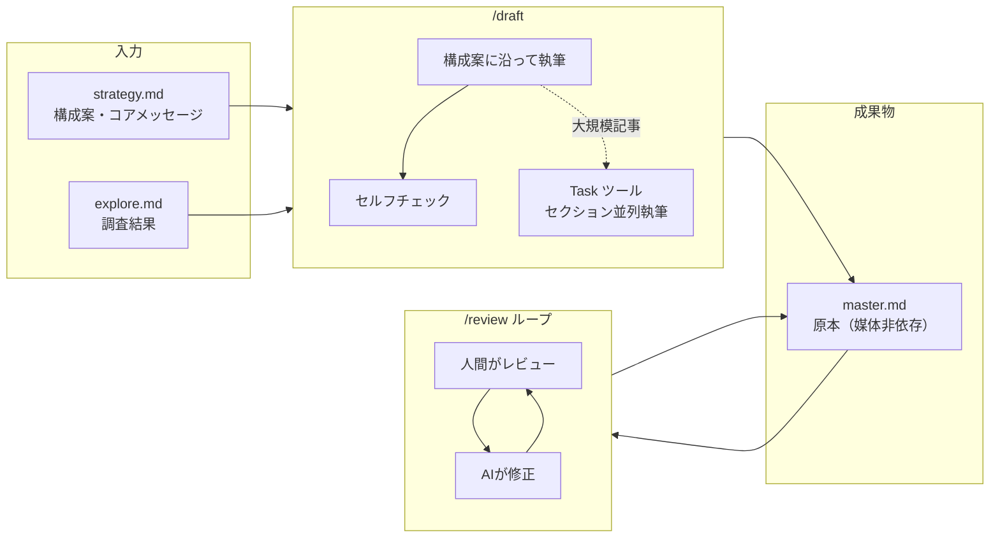
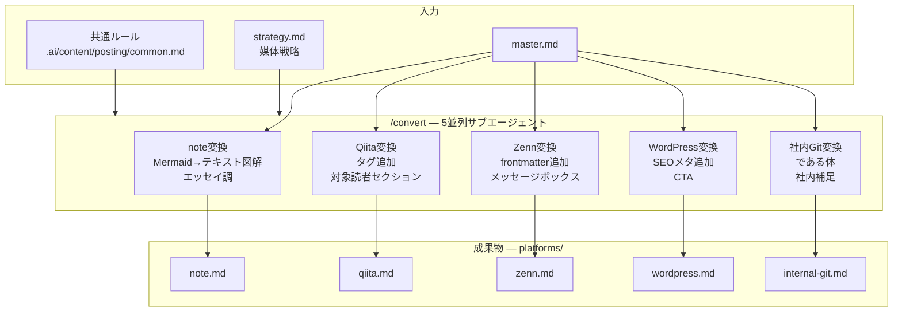
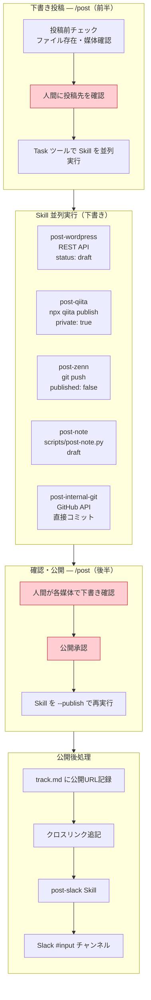
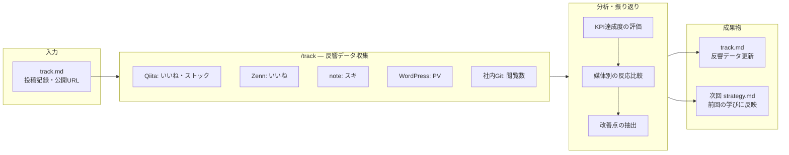
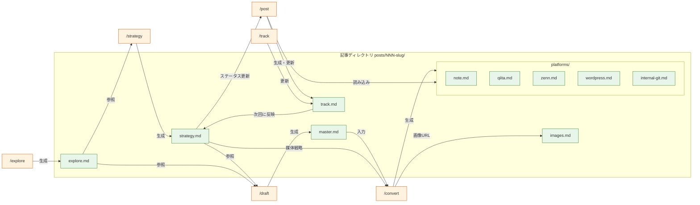
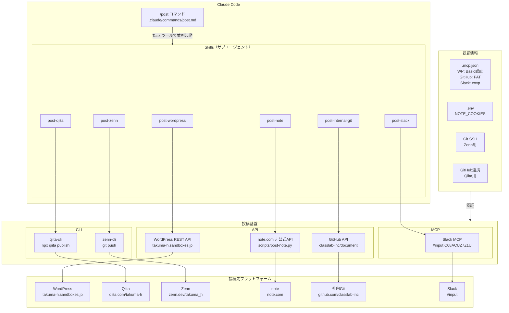
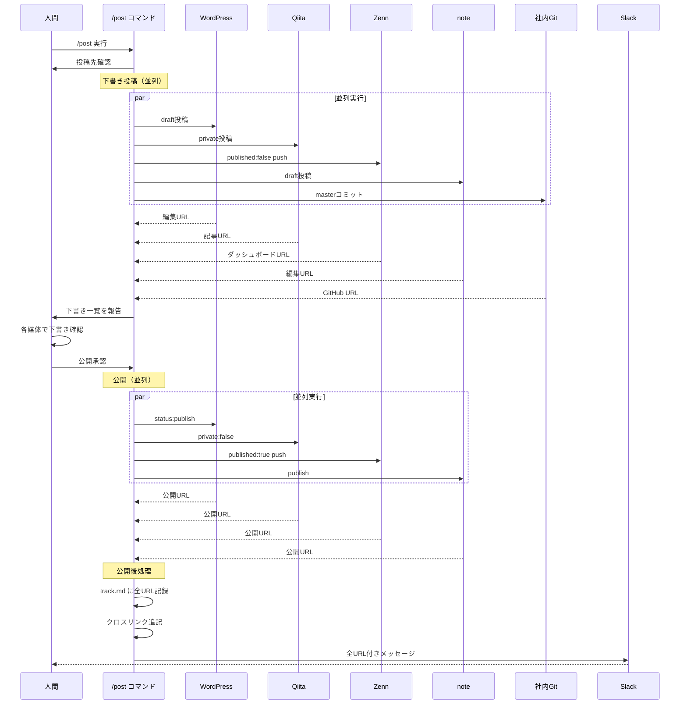

# ワークフロー・データフロー・投稿基盤 全体図

> ステータス: **確定**
> 最終更新: 2026-02-09

---

## 1. 全体フロー

**凡例**: 赤=人間主導 / 緑=AI主導 / 青=共同作業

---

## 2. コマンド・データ・ツールの流れ（詳細）

**凡例**: オレンジ=コマンド / 緑=データ / 青=Skill / 紫=ツール

---

## 3. フェーズ別詳細

### 3.1 ブレスト・企画

| 項目 | /explore | /strategy |
|------|----------|-----------|
| コマンド | `.claude/commands/explore.md` | `.claude/commands/strategy.md` |
| ルール | `.ai/content/brainstorm/explore.md` | `.ai/content/strategy/strategy.md` |
| ツール | WebSearch（競合調査） | なし（対話中心） |
| 入力 | テーマ（人間） | explore.md |
| 出力 | explore.md | strategy.md（ステータス: 確定） |

---

### 3.2 マスター作成

| 項目 | /draft | /review |
|------|--------|---------|
| コマンド | `.claude/commands/draft.md` | `.claude/commands/review.md` |
| ルール | `.ai/content/writing/draft.md` | `.ai/content/review/review.md` |
| ツール | Task（セクション並列執筆） | なし（対話） |
| 入力 | strategy.md + explore.md | master.md + 人間のフィードバック |
| 出力 | master.md | master.md（レビュー済み） |

---

### 3.3 媒体別変換

| 媒体 | 変換ルール | 主な変換内容 |
|------|-----------|-------------|
| note | `.ai/content/posting/note.md` | Mermaid→テキスト図解、エッセイ調、リード文追加 |
| Qiita | `.ai/content/posting/qiita.md` | タグコメント、対象読者セクション、参考リンク |
| Zenn | `.ai/content/posting/zenn.md` | YAML frontmatter、:::message ボックス |
| WordPress | `.ai/content/posting/wordpress.md` | SEOメタコメント、SEO見出し最適化、CTA |
| 社内Git | `.ai/content/posting/internal-git.md` | である体、社内向け補足セクション |

---

### 3.4 下書き投稿・公開・Slack展開

| Skill | 投稿手段 | 認証方式 | 下書き | 公開 |
|-------|---------|---------|--------|------|
| post-wordpress | WordPress REST API (curl) | Basic認証（.mcp.json） | `status: draft` | `status: publish` |
| post-qiita | `npx qiita publish` | GitHub連携 | `private: true` | `private: false` + `--force` |
| post-zenn | `git push` (zenn-cli) | Git SSH | `published: false` | `published: true` + push |
| post-note | `scripts/post-note.py` | Cookie認証（.env） | `draft` サブコマンド | `publish` サブコマンド |
| post-internal-git | GitHub API (curl) | Fine-grained PAT | masterに直接コミット | （コミット=公開） |
| post-slack | Slack MCP | xoxp トークン | - | メッセージ投稿 |

---

### 3.5 分析

| 項目 | 内容 |
|------|------|
| コマンド | `.claude/commands/track.md` |
| ルール | `.ai/content/track/track.md` |
| 計測タイミング | 投稿後1週間・1ヶ月 |
| KPI例 | Qiita いいね50+、Zenn いいね30+、note スキ20+、WP PV500+ |

---

## 4. データの生成・参照関係

---

## 5. 投稿基盤の全体構成

| 媒体 | 投稿基盤 | 認証情報の格納先 | プロトコル |
|------|---------|-----------------|-----------|
| WordPress | REST API (curl) | `.mcp.json` (username + password) | HTTPS |
| Qiita | qiita-cli (npm) | GitHub OAuth連携 | HTTPS |
| Zenn | zenn-cli + git push | Git SSH鍵 | SSH |
| note | scripts/post-note.py | `.env` (NOTE_COOKIES) | HTTPS |
| 社内Git | GitHub API (curl) | `.mcp.json` (Fine-grained PAT) | HTTPS |
| Slack | Slack MCP | `.mcp.json` (xoxp トークン) | HTTPS |

---

## 6. 投稿順序とタイミング

