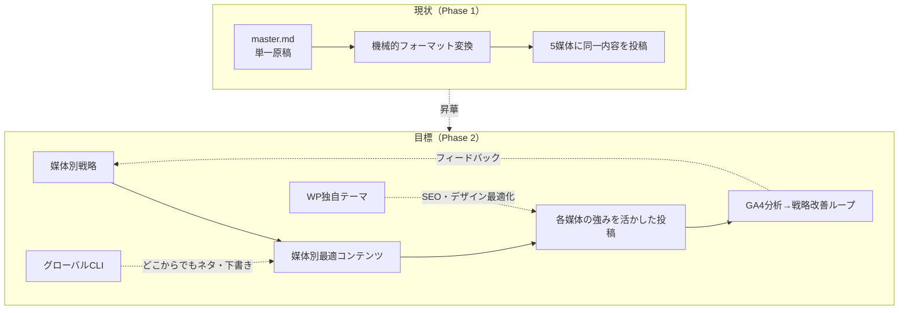
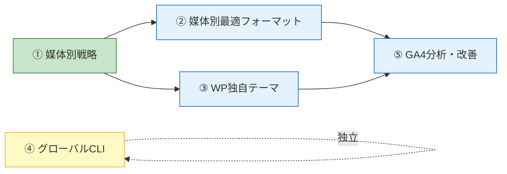
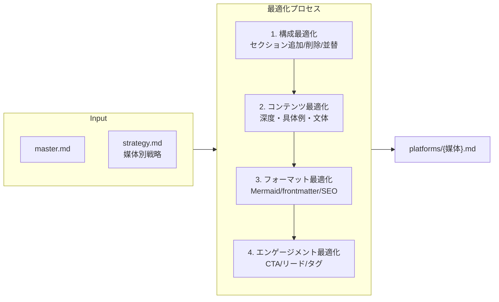
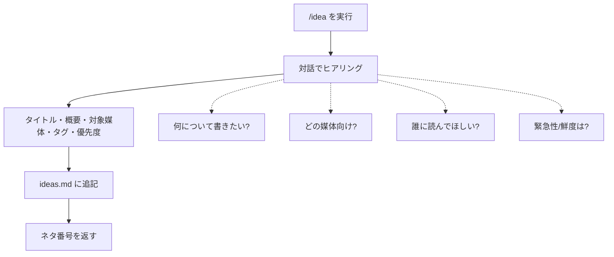
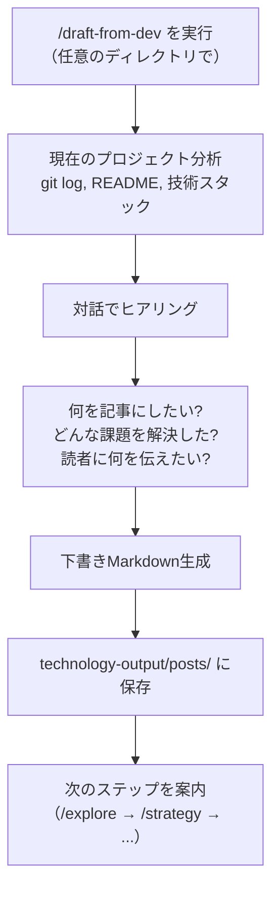
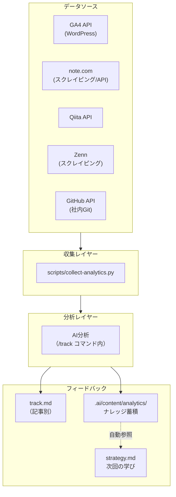
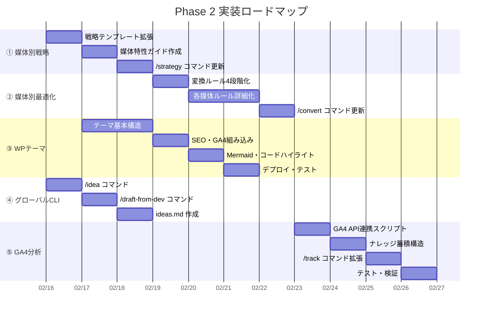

# Phase 2: プロジェクト昇華計画

> ステータス: **レビュー中**
> 最終更新: 2026-02-16

---

## 概要

5つの施策により、単一原稿→機械的変換の投稿システムから、**媒体ごとに最適化された戦略・コンテンツ・分析基盤**へ昇華させる。



---

## 施策一覧と依存関係



| # | 施策 | 依存 | 優先度 |
|---|------|------|--------|
| ① | 媒体別戦略 | なし | **最優先** |
| ② | 媒体別最適フォーマット | ①完了後 | 高 |
| ③ | WordPress独自テーマ | ①と並行可 | 高 |
| ④ | グローバルCLI | 独立（並行可） | 中 |
| ⑤ | GA4分析・改善 | ②③完了後 | 高 |

**推奨実装順**: ① → (②+③ 並行) → ⑤、④は随時

---

## 施策①: 媒体別戦略

### 現状の課題

- `strategy.md` に「媒体別の調整方針」欄はあるが自由記述で構造化されていない
- 全媒体同一ペルソナ・同一コアメッセージが前提
- 媒体ごとの読者層の違いを戦略レベルで表現できない

### 変更方針

**strategy.md のテンプレートを拡張**し、共通戦略＋媒体別戦略のハイブリッド構造にする。

```
strategy.md（拡張後）
├── 共通戦略（現行と同じ）
│   ├── 目的・ペルソナ・コアメッセージ・差別化・構成案
│   └── タイミング・KPI・前回の学び
└── 媒体別戦略（新規：構造化）
    ├── note: ペルソナ調整・切り口・トーン・構成変更・CTA
    ├── Qiita: ペルソナ調整・技術深度・タグ戦略・構成変更
    ├── Zenn: ペルソナ調整・技術深度・構成変更
    ├── WordPress: SEOキーワード・検索意図・構成変更・CTA
    └── 社内Git: 社内コンテキスト・補足方針
```

### 変更ファイル

| ファイル | 変更内容 |
|---------|---------|
| `.ai/content/strategy/template.md` | 媒体別戦略セクションを構造化テンプレートに拡張 |
| `.ai/content/strategy/strategy.md` | 媒体別戦略の策定ルール追加 |
| `.ai/content/strategy/platform-strategy-guide.md` | **新規**: 各媒体の特性・読者層・成功パターンのガイド |
| `.claude/commands/strategy.md` | 媒体別戦略の対話ステップ追加 |

### テンプレート拡張案（媒体別戦略セクション）

```markdown
## 媒体別戦略

### note
| 項目 | 内容 |
|------|------|
| この媒体での狙い | |
| ペルソナ調整 | （共通ペルソナとの差分） |
| 切り口・角度 | （ストーリー性、体験談寄りなど） |
| コアメッセージの言い換え | |
| 構成の変更点 | （セクション追加/削除/順序変更） |
| トーン | エッセイ調 / カジュアル技術解説 / etc. |
| CTA | |
| 目標文字数 | |

### Qiita
| 項目 | 内容 |
|------|------|
| この媒体での狙い | |
| ペルソナ調整 | |
| 技術深度 | （初心者向け / 中級 / 上級） |
| タグ戦略 | （タグ5つ + 選定理由） |
| 構成の変更点 | |
| コードサンプル方針 | |
| 目標文字数 | |

（以下 Zenn / WordPress / 社内Git も同様に構造化）
```

---

## 施策②: 媒体別最適フォーマット

### 現状の課題

- `common.md` のトーン/構造マトリクスは「変換ルール」であり「最適化ルール」ではない
- master.md → 各媒体版は主にフォーマット変換であり、コンテンツ自体の最適化が不十分
- 媒体別戦略（施策①）で決まった方針を反映する変換プロセスが未定義

### 変更方針

**変換プロセスを「フォーマット変換」から「コンテンツ最適化」に進化**させる。
施策①の媒体別戦略を入力として、コンテンツ構成・深度・表現を媒体ごとに最適化する。



### 変更ファイル

| ファイル | 変更内容 |
|---------|---------|
| `.ai/content/posting/common.md` | 変換プロセスを4段階最適化に拡張 |
| `.ai/content/posting/note.md` | note最適化ルール詳細化（ストーリー構成、導入パターン等） |
| `.ai/content/posting/qiita.md` | Qiita最適化ルール詳細化（再現性、タグSEO等） |
| `.ai/content/posting/zenn.md` | Zenn最適化ルール詳細化（Book連携、スクラップ活用等） |
| `.ai/content/posting/wordpress.md` | WordPress最適化ルール詳細化（SEO、内部リンク、スキーマ等） |
| `.ai/content/posting/internal-git.md` | 社内Git最適化ルール詳細化 |
| `.claude/commands/convert.md` | strategy.mdの媒体別戦略を参照する手順追加 |

---

## 施策③: WordPress独自テーマ

### 目的

- 技術ブログとしてのSEO・読みやすさ・ブランディングを最適化
- REST APIからの投稿フローとの完全互換
- GA4計測に必要なトラッキングコードの組み込み

### 構成

```
themes/
├── style.css                 ← テーマ情報・基本スタイル
├── functions.php             ← テーマ機能・REST API拡張
├── header.php                ← GA4タグ・OGP・構造化データ
├── footer.php
├── index.php
├── single.php                ← 記事詳細（目次自動生成・関連記事）
├── page.php
├── archive.php               ← 記事一覧
├── search.php
├── 404.php
├── assets/
│   ├── css/                  ← 技術記事向けタイポグラフィ
│   └── js/                   ← Mermaid対応・コードハイライト
├── template-parts/
│   ├── content-single.php    ← 記事本文テンプレート
│   ├── toc.php               ← 目次コンポーネント
│   ├── related-posts.php     ← 関連記事
│   ├── cta.php               ← CTA（他媒体リンク等）
│   └── schema-markup.php     ← 構造化データ（Article, BreadcrumbList）
└── inc/
    ├── seo.php               ← SEOヘルパー（OGP, canonical, meta）
    ├── analytics.php         ← GA4イベントトラッキング設定
    ├── rest-api.php          ← REST API拡張（カスタムフィールド対応）
    └── code-highlight.php    ← Prism.js / highlight.js 統合
```

### 主要機能

| 機能 | 実装 |
|------|------|
| Mermaid対応 | mermaid.js CDN読み込み + 自動レンダリング |
| コードハイライト | Prism.js（言語別ハイライト） |
| 目次自動生成 | H2/H3からJS/PHPで自動生成 |
| SEO | OGP, canonical, メタディスクリプション, 構造化データ |
| GA4 | gtag.js 組み込み + カスタムイベント（読了率, CTA等） |
| レスポンシブ | モバイル最適化（技術記事の可読性重視） |
| 関連記事 | カテゴリ/タグベースで自動表示 |
| CTA | 他媒体リンク・SNSシェア |
| REST API互換 | カスタムフィールド（SEOメタ等）をAPI経由で設定可能 |

### 実装アプローチ

- `wordpress-pro` スキルを活用して構築
- プロジェクト内に `themes/` ディレクトリを作成
- WordPress開発用MCP（wp-env等）を `.mcp.json` に追加
- 開発後、WordPress管理画面またはAPI経由でデプロイ

---

## 施策④: グローバルCLI

### 目的

このパソコンのどこからでも、思いついたアイデアや開発中の知見を記事ネタ・下書きとして保存できるようにする。

### 配置先

```
~/.claude/commands/
├── sc/                       ← 既存のSuperClaudeコマンド
├── idea.md                   ← ネタ帳追加コマンド（新規）
└── draft-from-dev.md         ← 開発下書き作成コマンド（新規）
```

### コマンド①: `/idea` — ネタ帳追加

**ユーザー体験**: 任意のディレクトリで `/idea` → 対話 → ネタが保存される



**保存先**: `{PROJECT_ROOT}/ideas.md`（新規ファイル）

```markdown
# ネタ帳

## IDEA-001: {タイトル}
- 日付: 2026-02-16
- 概要: {1-3行の説明}
- 対象媒体: note, Qiita, WordPress
- タグ: AI, 開発手法
- 優先度: 高 / 中 / 低
- 鮮度: 旬（1週間以内） / 通常 / ストック
- ステータス: ネタ / 記事化中 / 完了
- 記事: （記事化したら posts/NNN-slug へのリンク）
---

## IDEA-002: ...
```

### コマンド②: `/draft-from-dev` — 開発下書き作成

**ユーザー体験**: 開発中のプロジェクトで `/draft-from-dev` → ヒアリング → 下書きが保存される



**ヒアリング項目**:
1. 何を作った/解決したか（コンテキスト自動取得 + 補足質問）
2. 記事の切り口（ハウツー / 事例紹介 / 比較 / 振り返り）
3. 対象読者
4. 対象媒体（複数選択）
5. 優先度・鮮度

**保存**:
- `posts/{NNN}-{slug}/` ディレクトリ作成
- `draft-notes.md` に開発コンテキスト + ヒアリング結果を保存
- `ideas.md` にも登録（ネタ帳との連携）

---

## 施策⑤: GA4分析・改善

### 目的

- WordPress（主要SEO媒体）のGA4データを自動収集
- 各媒体の指標と統合して分析
- 分析結果をナレッジとして蓄積し、次の戦略に自動フィードバック

### アーキテクチャ



### GA4 API連携

| 項目 | 内容 |
|------|------|
| API | Google Analytics Data API (GA4) |
| 認証 | サービスアカウント（JSON鍵ファイル） |
| 収集指標 | PV, セッション, 滞在時間, 直帰率, ページ別, 流入元, デバイス |
| 収集スクリプト | `scripts/collect-ga4.py`（新規） |
| 環境変数 | `GA4_PROPERTY_ID`, `GA4_CREDENTIALS_PATH` |

### ナレッジ蓄積構造

```
.ai/content/analytics/
├── insights.md              ← 蓄積されたナレッジ（AI自動更新）
├── platform-benchmarks.md   ← 媒体別ベンチマーク（平均PV, 反応率等）
└── best-practices.md        ← 成功パターン・失敗パターン
```

**insights.md の例**:
```markdown
# 分析ナレッジ

## 発見: 2026-02-XX
- **観察**: Qiitaでは「具体的なコード例」がある記事のLGTM率が2倍
- **示唆**: Qiita向け戦略では必ずコードサンプルを含める
- **適用先**: .ai/content/posting/qiita.md, strategy template

## 発見: 2026-XX-XX
- **観察**: WordPress記事のH2見出しに疑問形を使うと滞在時間が30%増
- **示唆**: WordPress向けSEO見出しに疑問形パターンを追加
- **適用先**: .ai/content/posting/wordpress.md
```

### 変更ファイル

| ファイル | 変更内容 |
|---------|---------|
| `scripts/collect-ga4.py` | **新規**: GA4 APIからデータ収集 |
| `.ai/content/analytics/insights.md` | **新規**: 分析ナレッジ蓄積 |
| `.ai/content/analytics/platform-benchmarks.md` | **新規**: 媒体別ベンチマーク |
| `.ai/content/analytics/best-practices.md` | **新規**: 成功/失敗パターン |
| `.ai/content/track/track.md` | GA4データ収集手順を追加 |
| `.claude/commands/track.md` | GA4連携 + ナレッジ蓄積ステップ追加 |
| `.claude/commands/strategy.md` | analytics/ナレッジの自動参照ステップ追加 |

---

## 実装ロードマップ



---

## 全変更ファイル一覧

### 新規作成

| ファイル | 施策 |
|---------|------|
| `.ai/content/strategy/platform-strategy-guide.md` | ① |
| `.ai/content/analytics/insights.md` | ⑤ |
| `.ai/content/analytics/platform-benchmarks.md` | ⑤ |
| `.ai/content/analytics/best-practices.md` | ⑤ |
| `themes/` (ディレクトリ一式) | ③ |
| `scripts/collect-ga4.py` | ⑤ |
| `ideas.md` | ④ |
| `~/.claude/commands/idea.md` | ④ |
| `~/.claude/commands/draft-from-dev.md` | ④ |

### 変更

| ファイル | 施策 |
|---------|------|
| `.ai/content/strategy/template.md` | ① |
| `.ai/content/strategy/strategy.md` | ① |
| `.ai/content/posting/common.md` | ② |
| `.ai/content/posting/note.md` | ② |
| `.ai/content/posting/qiita.md` | ② |
| `.ai/content/posting/zenn.md` | ② |
| `.ai/content/posting/wordpress.md` | ②③ |
| `.ai/content/posting/internal-git.md` | ② |
| `.ai/content/track/track.md` | ⑤ |
| `.claude/commands/strategy.md` | ①⑤ |
| `.claude/commands/convert.md` | ② |
| `.claude/commands/track.md` | ⑤ |
| `CLAUDE.md` | 全体 |
| `docs/design/00-overview.md` | 全体 |

### テスト

| ファイル | 内容 |
|---------|------|
| `tests/test-strategy-template.sh` | 媒体別戦略テンプレートの構造チェック |
| `tests/test-global-commands.sh` | グローバルコマンドの存在・構造チェック |
| `tests/test-wp-theme.sh` | WPテーマファイル構造チェック |
| `tests/test-analytics.sh` | 分析ナレッジ構造チェック |
