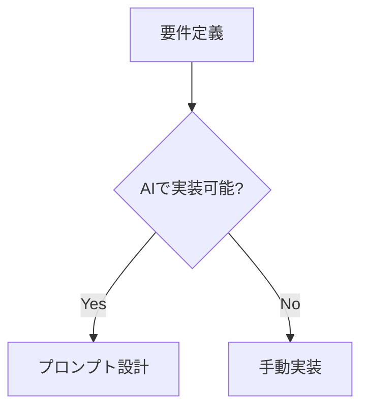

# Engineer Blog テーマ 全機能リファレンス

Engineer Blog テーマ（engineer-blog v1.0.0）で使用可能な全機能の一覧。
`/convert` で master.md → wordpress.md に変換する際、この仕様に従ってリッチなコンテンツを生成する。

テーマは以下の4カテゴリの機能を提供する:
1. **ショートコード** — 11種の独自ショートコード
2. **HTMLスタイル** — テーマCSSによるHTML要素のスタイリング
3. **コードハイライト** — Prism.js による12言語対応シンタックスハイライト
4. **Mermaid.js 図解** — 4種類のダイアグラム自動レンダリング
5. **テーマ自動機能** — 目次・読了時間・閲覧数・シェアボタン等

---

## 注意事項

- ショートコードはブロックレベル（単独行）で記述する。`<!-- wp:paragraph -->` の中に入れない
- ショートコード名を本文中にコード表示したい場合は `&#91;note&#93;` のようにHTMLエンティティでエスケープする
- インラインショートコード（`[badge]`, `[marker]`）は `<!-- wp:paragraph -->` 内の `<p>` タグの中で使用可能

---

## ショートコード一覧

### 1. 注釈ボックス（Callout）

4種類のカラーバリエーション。補足情報や注意事項の強調に使用。

```
[note]補足情報のテキスト[/note]
[warning]注意事項のテキスト[/warning]
[tip]ヒントのテキスト[/tip]
[info]一般情報のテキスト[/info]
```

| 属性 | 必須 | 説明 |
|------|------|------|
| `title` | - | ヘッダーラベルを上書き（デフォルト: Note/Warning/Tip/Info） |

**カラー**: note=青, warning=黄, tip=緑, info=紫

**使いどころ**: 読者に特に注意してほしい箇所、補足説明、ベストプラクティス

### 2. 引用ボックス（Quote）

出典付きの引用。左ボーダー + 大きなクォート記号のデザイン。

```
[quote author="著者名" source="出典名" url="https://example.com"]引用テキスト[/quote]
```

| 属性 | 必須 | 説明 |
|------|------|------|
| `author` | - | 著者名 |
| `source` | - | 出典名（urlがあればリンク化） |
| `url` | - | 出典URL |

### 3. タイムライン

年表・経歴・プロジェクト進行の表現。垂直ライン + マーカーのデザイン。

```
[timeline]
[timeline_item date="2024年1月" title="フェーズ1"]説明テキスト[/timeline_item]
[timeline_item date="2024年4月" title="フェーズ2"]説明テキスト[/timeline_item]
[/timeline]
```

| 属性 | 必須 | 説明 |
|------|------|------|
| `date` | - | 日付バッジのテキスト |
| `title` | - | 項目タイトル（h4） |
| `icon` | - | マーカー内のアイコン文字 |

### 4. ステップガイド

手順説明。番号付き丸アイコン + カード形式。CSSカウンターで自動採番。

```
[steps]
[step title="ステップ1のタイトル"]説明テキスト[/step]
[step title="ステップ2のタイトル"]説明テキスト[/step]
[step title="ステップ3のタイトル"]説明テキスト[/step]
[/steps]
```

| 属性 | 必須 | 説明 |
|------|------|------|
| `title` | - | ステップタイトル（h4） |

### 5. リンクカード

外部リンクのリッチプレビュー。タイトル・説明・ドメイン表示。

```
[link_card url="https://example.com" title="サイト名" description="説明文" image="https://example.com/og.jpg"]
```

| 属性 | 必須 | 説明 |
|------|------|------|
| `url` | **必須** | リンク先URL |
| `title` | - | タイトル（省略時はURL表示） |
| `description` | - | 説明文（2行まで表示） |
| `image` | - | サムネイル画像URL |

### 6. Amazonリンク

Amazon商品カード。オレンジのアクセントカラー。

```
[amazon asin="4297127830" title="書籍タイトル" price="¥2,640" image="https://..." tag="affiliate-tag"]
```

| 属性 | 必須 | 説明 |
|------|------|------|
| `asin` | △ | Amazon ASIN（titleと併用推奨） |
| `title` | △ | 商品タイトル |
| `image` | - | 商品画像URL |
| `price` | - | 価格表示 |
| `tag` | - | アフィリエイトタグ |

### 7. バッジ（インライン）

インラインのラベルバッジ。`<p>` タグ内で使用。

```
[badge color="primary"]NEW[/badge]
[badge color="accent"]推奨[/badge]
[badge color="warning"]β版[/badge]
[badge color="danger"]非推奨[/badge]
```

| 属性 | 必須 | 説明 |
|------|------|------|
| `color` | - | primary(青) / accent(緑) / warning(黄) / danger(赤)。デフォルト: primary |

### 8. マーカー / ハイライト（インライン）

テキストにグラデーションの下線マーカー。`<p>` タグ内で使用。

```
[marker color="yellow"]強調テキスト[/marker]
[marker color="blue"]青マーカー[/marker]
[marker color="pink"]ピンクマーカー[/marker]
[marker color="green"]緑マーカー[/marker]
```

| 属性 | 必須 | 説明 |
|------|------|------|
| `color` | - | yellow / blue / pink / green。デフォルト: yellow |

### 9. アコーディオン

折りたたみコンテンツ。FAQ形式に最適。`<details>/<summary>` ベース。

```
[accordion]
[accordion_item title="質問1"]回答テキスト[/accordion_item]
[accordion_item title="質問2"]回答テキスト[/accordion_item]
[accordion_item title="質問3" open="true"]初期展開状態の回答[/accordion_item]
[/accordion]
```

| 属性 | 必須 | 説明 |
|------|------|------|
| `title` | - | ヘッダーテキスト |
| `open` | - | `"true"` で初期展開 |

### 10. カラムレイアウト

2〜4段組みのグリッドレイアウト。レスポンシブ対応（モバイルは1カラム）。

```
[columns count="2"]
[column]左カラムの内容[/column]
[column]右カラムの内容[/column]
[/columns]
```

| 属性 | 必須 | 説明 |
|------|------|------|
| `count` | - | カラム数 2〜4。デフォルト: 2 |

### 11. 比較テーブル

A vs B の比較表示。ヘッダーに「VS」表記。

```
[comparison title_a="React" title_b="Vue"]
<table>
<tr><td>学習コスト</td><td>中</td><td>低</td></tr>
<tr><td>エコシステム</td><td>大</td><td>中</td></tr>
</table>
[/comparison]
```

| 属性 | 必須 | 説明 |
|------|------|------|
| `title_a` | - | 左側タイトル。デフォルト: A |
| `title_b` | - | 右側タイトル。デフォルト: B |

---

## HTMLスタイル（entry-content 内）

ショートコード以外にも、以下のHTML要素がテーマCSSでスタイリング済み。

### 見出し

```html
<h2>グラデーション左ボーダー付き見出し</h2>
<h3>緑の左ボーダー付き小見出し</h3>
<h4>太字のサブ見出し</h4>
```

- `<h2>`: 紫→青グラデーションの左ボーダー、大きめフォント
- `<h3>`: 緑の左ボーダー
- `<h4>`: ボーダーなし、太字

### コードブロック（Prism.js 12言語対応）

```html
<pre class="language-javascript" data-lang="JavaScript"><code>
const hello = "world";
</code></pre>
```

- ダーク背景 + 角丸 + シャドウ
- `data-lang` 属性でラベルバッジを表示（右上にグラデーション背景）
- Prism.js によるシンタックスハイライト

#### 対応言語一覧（12言語）

| CSS クラス | `data-lang` ラベル | 用途 |
|-----------|-------------------|------|
| `language-javascript` | `JavaScript` | フロントエンド / Node.js |
| `language-typescript` | `TypeScript` | 型付きJS |
| `language-python` | `Python` | バックエンド / AI / スクリプト |
| `language-php` | `PHP` | WordPress / サーバーサイド |
| `language-bash` | `Bash` | シェルスクリプト / コマンド |
| `language-go` | `Go` | バックエンド / インフラ |
| `language-rust` | `Rust` | システム / パフォーマンス |
| `language-sql` | `SQL` | データベースクエリ |
| `language-json` | `JSON` | 設定ファイル / APIレスポンス |
| `language-yaml` | `YAML` | CI/CD / 設定ファイル |
| `language-diff` | `Diff` | 差分表示 |
| `language-markdown` | `Markdown` | ドキュメント記法 |

### インラインコード

```html
<code>inline code</code>
```

- 紫テキスト + グラデーション背景（薄紫）

### テーブル

```html
<table>
  <thead><tr><th>ヘッダー1</th><th>ヘッダー2</th></tr></thead>
  <tbody>
    <tr><td>データ1</td><td>データ2</td></tr>
  </tbody>
</table>
```

- 角丸 + シャドウ + ヘッダーグラデーション背景
- ホバー時に行ハイライト

### 引用

```html
<blockquote>
  <p>引用テキスト</p>
</blockquote>
```

- グラデーション左ボーダー + 薄い背景色 + イタリック体
- ※出典付きの場合は `[quote]` ショートコードを推奨

### リスト

```html
<ul><li>箇条書き項目</li></ul>
<ol><li>番号付き項目</li></ol>
```

- 適切な余白とインデント

### 画像

```html

<!-- or Gutenberg block -->
<!-- wp:image -->
<figure class="wp-block-image"></figure>
<!-- /wp:image -->
```

- 角丸（8px）+ 中央寄せ

### Mermaid.js 図解（4種類対応）

```html
<!-- wp:html -->
<pre class="mermaid">
graph TD
  A --> B
</pre>
<!-- /wp:html -->
```

- 薄い背景 + ボーダー + 角丸 + 中央寄せ
- Mermaid.js による自動レンダリング（CDN読み込み）
- **重要**: `<div>` ではなく `<pre>` を使用すること。WordPress の `wptexturize` フィルタが `<div>` 内の `-->` を `–>`（en-dash）、`---` を `—`（em-dash）、`"..."` をスマートクォートに変換し、Mermaid 構文エラーの原因となる。`<pre>` タグ内はテキスト変換がスキップされる
- 必ず `<!-- wp:html -->` / `<!-- /wp:html -->` で囲むこと

#### 対応ダイアグラム

| 種類 | Mermaid記法 | 用途 |
|------|------------|------|
| フローチャート | `flowchart TD` / `graph TD` | 処理フロー、意思決定フロー |
| シーケンス図 | `sequenceDiagram` | API呼び出し、コンポーネント間通信 |
| ガントチャート | `gantt` | プロジェクトスケジュール、タイムライン |
| クラス図 | `classDiagram` | データモデル、クラス構造 |

#### 変換例

master.md:
````

````

wordpress.md:
```html
<!-- wp:html -->
<pre class="mermaid">
flowchart TD
  A[要件定義] --> B{AIで実装可能?}
  B -->|Yes| C[プロンプト設計]
  B -->|No| D[手動実装]
</pre>
<!-- /wp:html -->
```

---

## Gutenbergブロック記法

WordPress投稿ではGutenbergブロックコメントでコンテンツを構造化する。

```html
<!-- wp:paragraph -->
<p>段落テキスト</p>
<!-- /wp:paragraph -->

<!-- wp:heading -->
<h2>見出し</h2>
<!-- /wp:heading -->

<!-- wp:heading {"level":3} -->
<h3>小見出し</h3>
<!-- /wp:heading -->

<!-- wp:code -->
<pre class="wp-block-code"><code>コード</code></pre>
<!-- /wp:code -->

<!-- wp:image -->
<figure class="wp-block-image"></figure>
<!-- /wp:image -->

<!-- wp:list -->
<ul><li>項目</li></ul>
<!-- /wp:list -->

<!-- wp:table -->
<figure class="wp-block-table"><table>...</table></figure>
<!-- /wp:table -->
```

ショートコードはブロックの外（トップレベル）に直接記述する:

```
<!-- wp:heading -->
<h2>セクション見出し</h2>
<!-- /wp:heading -->

[note]ショートコードはブロックの外に置く[/note]
```

---

## 変換時の推奨マッピング

master.md のMarkdown記法から WordPress 用への変換ガイドライン:

| master.md の記法 | WordPress 変換先 |
|-----------------|-----------------|
| `> 引用` | `[quote]` ショートコード（出典あり）または `<blockquote>`（出典なし） |
| `> **Note**: ...` / `> ⚠️ ...` | `[note]` / `[warning]` ショートコード |
| `> 💡 ...` / `> ℹ️ ...` | `[tip]` / `[info]` ショートコード |
| `==ハイライト==` | `[marker]テキスト[/marker]` |
| 手順（1. 2. 3.）+ 説明 | `[steps]` + `[step]` ショートコード |
| 年表・時系列データ | `[timeline]` + `[timeline_item]` ショートコード |
| FAQ形式 | `[accordion]` + `[accordion_item]` ショートコード |
| 外部リンク（参考記事） | `[link_card]` ショートコード |
| Amazon書籍紹介 | `[amazon]` ショートコード |
| 比較表 | `[comparison]` ショートコード |
| 2〜4列レイアウト | `[columns]` + `[column]` ショートコード |
| `**太字キーワード**` | そのまま `<strong>` または `[badge]` |
| `*斜体*` | `<em>テキスト</em>` |
| `~~打ち消し~~` | `<del>テキスト</del>` |
| `` `インラインコード` `` | `<code>コード</code>`（紫テキスト + グラデーション背景） |
| `[リンク](url)` | `<a href="url">リンク</a>` |
| コードブロック `` ```lang `` | `<pre class="language-lang" data-lang="Lang"><code>...</code></pre>` |
| Mermaid `` ```mermaid `` | `<!-- wp:html --><pre class="mermaid">...</pre><!-- /wp:html -->` |
| `` | `<figure class="wp-block-image"></figure>` |
| `---`（水平線） | `<hr />` |

---

## テーマ自動機能

以下の機能は記事を書くだけで自動的に適用される。変換時に意識する必要はないが、SEOメタ情報の設定は必要。

| 機能 | 説明 | 設定 |
|------|------|------|
| 目次（TOC） | H2/H3から自動生成、スクロール追従 | 不要 |
| 読了時間 | 日本語600文字/分で自動計算 | 不要 |
| 閲覧数 | ページビューを自動カウント | 不要 |
| リーディングプログレスバー | 読み進め具合をページ上部に表示 | 不要 |
| パンくずリスト | カテゴリに基づき自動生成 | 不要 |
| シェアボタン | X / Facebook / はてブ / URLコピー | 不要 |
| 著者プロフィール | WPユーザー情報から自動表示 | プロフィール設定 |
| 関連記事 | 同カテゴリ・タグから自動抽出 | 不要 |
| クロスプラットフォームCTA | note/Qiita/Zennへの誘導 | カスタマイザー |
| OGP/SEO メタタグ | 構造化データ自動出力 | SEOメタボックス |
| GA4イベント | 読了率・CTAクリック・コードコピー | カスタマイザー |
| いいね機能 | 記事ごとのいいねボタン + ランキング | 不要 |
| Mermaidレンダリング | `<pre class="mermaid">` を図解に自動変換 | 不要 |
| コード言語ラベル | `data-lang` 属性で右上にラベル表示 | 不要 |
| Prism.js ハイライト | 12言語のシンタックスハイライト | 不要 |

### SEOメタ情報（変換時に必須）

```html
<!-- SEO
title: SEOタイトル（60字以内）
description: メタディスクリプション（120字以内）
category: カテゴリ
tags: タグ1, タグ2
-->
```
