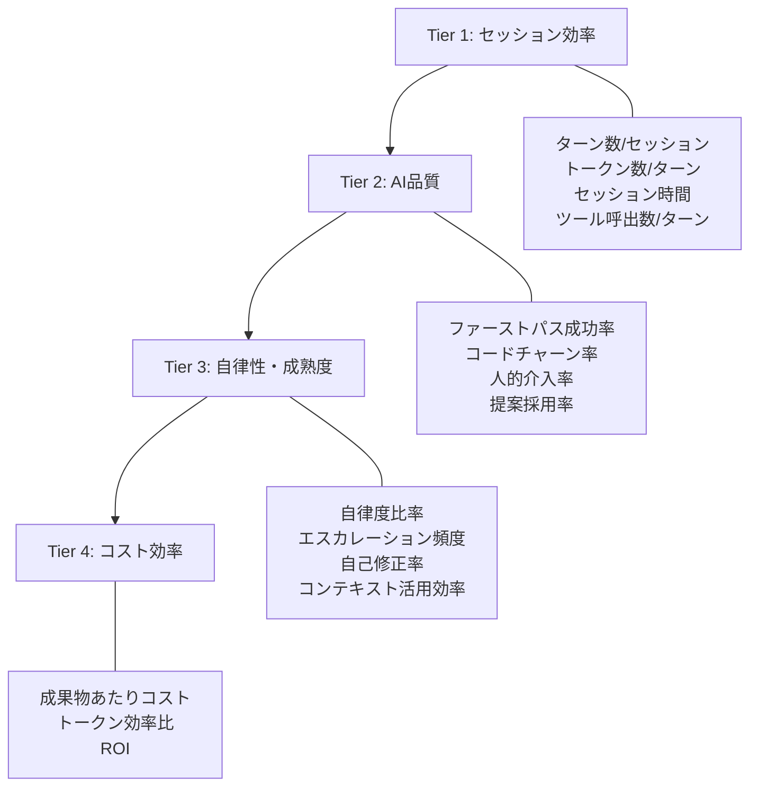
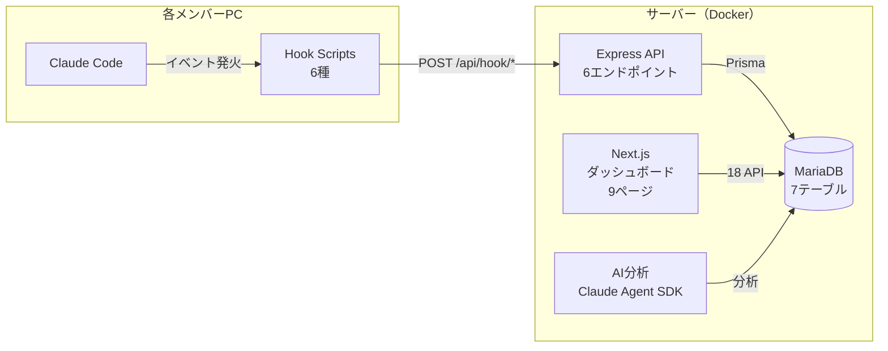
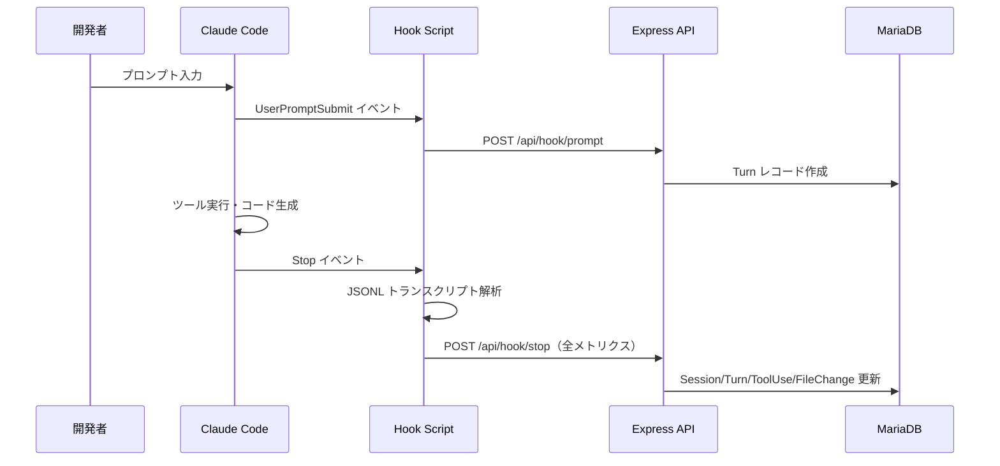

## この記事の対象読者

- Claude Code をチームで利用しているエンジニア・テックリード
- AI コーディングツールの導入効果を定量的に示したい方
- Hooks API を使ったカスタム連携に興味がある方

## この記事で得られること

- AI コーディングの効果を計測するための **4ティア KPI 体系** の設計思想
- Claude Code の **Hooks API** を使った利用データ自動収集の設計・実装（Prisma スキーマ、トランスクリプト解析、コスト計算）
- チーム全体の AI 活用を可視化する **9ページのダッシュボード** の機能紹介（スクリーンショット7枚付き）

---

## 導入: 「Claude Code を使いなさすぎる」と言われた

「メンバー全員、Claude Code をもっと使うべきだ。MAX×20プランを使い切るぐらい活用してほしい」

上長からこう言われたとき、正直返す言葉がありませんでした。チームに Claude Code の Max プランを導入して数ヶ月。「便利になった」「コードレビューが楽になった」という声は聞こえてくるものの、**実際にどのメンバーがどれくらい使っていて、どんなタスクに活用しているのか**――そのデータがどこにもなかったのです。

:::note warn
METR（Model Evaluation & Threat Research）の研究では、経験豊富な開発者16人を対象としたランダム化比較試験で、AIツール使用時に生産性が **19%低下** したという結果が報告されています。しかも開発者自身は「24%速くなった」と予想し、実験後も「20%速くなった」と感じていました。**体感と実態のギャップ**は他人事ではありません[^1]。
:::

「なんとなく便利」では投資対効果を示せません。チームの AI 活用を改善するには、まず**計測できる状態を作る**必要があります。

そこで構築したのが、Claude Code の **Hooks API** を使ったチーム利用状況の自動収集・可視化システムです。

[^1]: [METR "Measuring the Impact of Early-Stage AI Assistance on Coding"](https://metr.org/blog/2025-07-10-early-stage-ai-impact/)

## AIエージェントが「上手く使えている」とは何か

AI コーディングツールの効果をどう定義し、何を測るべきでしょうか。単純な「コード生成行数」や「使用時間」では本質を捉えられません。

チーム運用の中で見えてきた計測軸を、**4つのティアに体系化**しました。

### 4ティア KPI 体系



**Tier 1（セッション効率）** は最も基礎的な指標です。1セッションあたりのターン数が3〜8回なら効率的、40回を超えると非効率なセッションの可能性があります。ツール呼出数が多ければ AI が自律的に作業を進めている証拠になります。

**Tier 2（AI品質）** は、AI の提案がどれだけ「一発で通る」かを測ります。ファーストパス成功率が60%を超えていれば良好、コードチャーン率（AI が書いたコードが72時間以内に書き直される割合）が30%を超えていると要改善です。

**Tier 3（自律性・成熟度）** は、人間の介入なしに AI がどこまで自走できるかの指標です。自律度比率80%以上がエキスパートレベルとなります。

**Tier 4（コスト効率）** は投資対効果の核心です。成果物（PR・バグ修正等）あたりのコストや、トークン効率比（消費トークン÷採用されたコード行数）で測ります。

:::note info
各ティアのベンチマークをまとめた表です。自チームの現状と照らし合わせてみてください。Tier 1 から順に計測環境を整えていくのがおすすめです。
:::

| レベル | ターン数/セッション | ファーストパス成功率 | 自律度比率 | 日次コスト目安 |
|--------|---------------------|---------------------|-----------|---------------|
| Expert | 3〜8 | 70%以上 | 80%以上 | $4以下 |
| Advanced | 9〜15 | 50〜70% | 60〜80% | $4〜8 |
| Intermediate | 16〜25 | 30〜50% | 40〜60% | $8〜15 |
| Beginner | 25以上 | 30%未満 | 40%未満 | $15以上 |

## 設計: Hooks API で利用データを自動収集する

### 全体アーキテクチャ



各メンバーの PC に配置した **6種のフックスクリプト** が、Claude Code のライフサイクルイベントを検知し、中央サーバーに自動送信します。メンバーは普段の開発作業をそのまま行うだけで、データが蓄積されていきます。

### 6種のフックイベント

| フック | タイミング | 取得データ |
|--------|----------|-----------|
| SessionStart | セッション開始 | モデル名、開始種別、Git リポジトリ・ブランチ |
| UserPromptSubmit | プロンプト送信 | プロンプト全文 |
| SubagentStart | サブエージェント起動 | エージェント種別（Bash/Explore/Plan等） |
| SubagentStop | サブエージェント終了 | トークン消費量、ツール使用記録 |
| **Stop** | **応答完了** | **トランスクリプト解析 → 全メトリクス** |
| SessionEnd | セッション終了 | 終了理由（user_exit/clear/logout） |

最も重要なのは **Stop フック** です。Claude Code が応答を完了するたびに発火し、JSONL 形式のトランスクリプトファイルを解析して、セッション全体のトークン消費量・ツール使用・ファイル変更・エラー数などを一括で集計します。

### データフロー



### DB スキーマ（7テーブル）

| テーブル | 役割 | 主なカラム |
|---------|------|-----------|
| Member | メンバー情報 | git_email（主キー）、claude_account |
| Session | セッション情報 | session_uuid、total_input_tokens、total_output_tokens、estimated_cost、turn_count |
| Turn | ターン情報 | prompt_text、duration_ms、input_tokens、output_tokens、model |
| Subagent | サブエージェント | agent_type、duration_seconds、input_tokens、output_tokens |
| ToolUse | ツール使用記録 | tool_name、tool_category、status、is_mcp、mcp_server |
| FileChange | ファイル変更記録 | file_path、operation（read/write/edit） |
| SessionEvent | セッションイベント | event_type、event_data（JSON） |

### インストーラ

チームメンバーがワンコマンドでセットアップできるインストーラを用意しました。

```bash
bash <(curl -s https://your-server/install.sh)
```

インストーラは以下を自動実行します。

1. 6種のフックスクリプトを `~/.claude/hooks/` に配置
2. API 接続先の設定ファイル（`config.json`）を生成
3. Claude Code のグローバル設定（`~/.claude/settings.json`）にフック定義をマージ
4. API サーバーへの疎通テストを実行

:::note info
既存のフック設定がある場合も安全にマージされるため、開発環境を壊さない設計になっています。
:::

### 必要なキー設定

本システムを利用するには、以下の3つのキーを設定します。

| キー | 用途 | 設定場所 |
|------|------|---------|
| GitHub PAT（Personal Access Token） | リポジトリ・ブランチ情報の取得、コード変更の追跡 | サーバー側環境変数 |
| Claude Code 認証（2種から選択） | ダッシュボードの AI 分析チャット・コーチング機能（Claude Agent SDK） | サーバー側環境変数 |

Claude Code の認証は以下の2種類から選択できます:

1. **Max プランのサブスクリプション**（OAuth ログイン）
2. **Anthropic API Key**

- **GitHub PAT** を設定すると、セッションごとのリポジトリ名・ブランチ名を自動取得し、リポジトリ分析ページでプロジェクト単位の AI 活用状況を可視化できます
- **Claude Code 認証** を設定すると、チーム概要・メンバー詳細ページの AI 分析チャットが利用可能になり、データに基づいた自然言語での質問や改善提案を受けられます。Max プランのサブスク契約があればそのまま利用でき、API Key でも同等の機能が使えます

:::note info
GitHub PAT は `repo` スコープが必要です。Claude Code 認証は Max プランのサブスクリプションまたは Anthropic API Key のどちらか一方を設定してください。
:::

## 実装のポイント

### Prisma スキーマ

セッション単位でトークン消費量を追跡します。Anthropic のプロンプトキャッシュ機能に対応し、`cache_creation_tokens` と `cache_read_tokens` を分離して記録している点がポイントです。

```prisma:prisma/schema.prisma
model Session {
  id                       Int       @id @default(autoincrement())
  memberId                 Int?      @map("member_id")
  sessionUuid              String    @unique @map("session_uuid")
  model                    String?
  totalInputTokens         Int       @default(0) @map("total_input_tokens")
  totalOutputTokens        Int       @default(0) @map("total_output_tokens")
  totalCacheCreationTokens Int       @default(0) @map("total_cache_creation_tokens")
  totalCacheReadTokens     Int       @default(0) @map("total_cache_read_tokens")
  estimatedCost            Float?    @map("estimated_cost") @db.Double
  turnCount                Int       @default(0) @map("turn_count")
  toolUseCount             Int       @default(0) @map("tool_use_count")
  summary                  String?   @db.Text
  gitRepo                  String?   @map("git_repo")
  gitBranch                String?   @map("git_branch")

  member        Member?        @relation(fields: [memberId], references: [id])
  turns         Turn[]
  toolUses      ToolUse[]
  fileChanges   FileChange[]
  sessionEvents SessionEvent[]

  startedAt             DateTime? @map("started_at")

  @@index([memberId])
  @@index([startedAt])
  @@index([model])
  @@map("sessions")
}
```

### トランスクリプト解析

Stop フックの核心は、Claude Code が出力する JSONL 形式のトランスクリプトファイルの解析です。JSONL の各行は `assistant`、`user`、`system`、`summary` のいずれかの type を持ちます。

```javascript:hooks/lib/transcript-parser.js
function parseTranscript(transcriptPath) {
  const lines = fs.readFileSync(transcriptPath, 'utf8')
    .split('\n').filter(Boolean);

  for (const line of lines) {
    const obj = JSON.parse(line);

    if (obj.type === 'assistant') {
      // トークン数・モデル名を集計
      // tool_use ブロックからツール使用を抽出
      // Write/Edit ツールからファイル変更を記録
    }

    if (obj.type === 'user') {
      // tool_result でなければ新しいターン
      // tool_result のエラーをツール使用記録に反映
    }

    if (obj.type === 'system') {
      // turn_duration: ターンごとの所要時間
      // compact_boundary: コンテキスト圧縮イベント
    }
  }
}
```

ツール使用は7カテゴリに自動分類されます。

```javascript:hooks/lib/tool-category.js
function getToolCategory(name) {
  if (/^(Read|Glob|Grep)$/.test(name)) return 'search';
  if (/^(Write|Edit|MultiEdit)$/.test(name)) return 'file_edit';
  if (name === 'Bash') return 'bash';
  if (name === 'Task') return 'subagent';
  if (/^(WebFetch|WebSearch)$/.test(name)) return 'web';
  if (/^mcp__/.test(name)) return 'mcp';
  return 'other';
}
```

MCP（Model Context Protocol）ツールは `mcp__` プレフィックスで自動検出し、どの MCP サーバー経由の呼び出しかも記録します。

### コスト計算

モデルごとの単価テーブルに基づき、セッション単位でコストを算出します。プロンプトキャッシュの書き込み・読み込みも個別単価で計算するため、**キャッシュ効率の分析**も可能です。

```typescript:lib/cost-calculator.ts
const COST_TABLE = {
  'claude-opus-4-6':   { input: 15,   output: 75, cacheWrite: 18.75, cacheRead: 1.50 },
  'claude-sonnet-4-5': { input: 3,    output: 15, cacheWrite: 3.75,  cacheRead: 0.30 },
  'claude-haiku-4-5':  { input: 0.80, output: 4,  cacheWrite: 1.00,  cacheRead: 0.08 },
};

// 単位: USD per 1M tokens
function calculateCost(model, usage) {
  const rates = COST_TABLE[model];
  return (usage.inputTokens / 1_000_000) * rates.input
       + (usage.outputTokens / 1_000_000) * rates.output
       + (usage.cacheCreationTokens / 1_000_000) * rates.cacheWrite
       + (usage.cacheReadTokens / 1_000_000) * rates.cacheRead;
}
```

:::note warn
コスト計算はプロンプトキャッシュを考慮しないと大きく乖離します。特に Opus では通常入力 $15/1M tokens に対しキャッシュ読み込みが $1.50/1M tokens と **10倍の差** があるため、キャッシュ効率の可視化が重要です。
:::

## ダッシュボードの機能紹介

構築したダッシュボードは9つのページで構成されています。主要な画面をスクリーンショット付きで紹介します。

### 1. チーム概要


チーム全体の利用状況を俯瞰するトップページです。

- **KPIカード**: 総セッション数、総トークン数、推定コスト（前週比トレンド付き）、アクティブメンバー数
- **日次トークン推移**: 入力・出力トークンの折れ線グラフで利用トレンドを把握
- **ツール使用ランキング**: よく使われているツールTop 10（Read、Edit、Bash、Grep 等）
- **ヒートマップ**: 曜日×時間帯 / リポジトリ×日付 / メンバー×日付の3軸で分析可能

「いつ、誰が、どのリポジトリで作業しているか」がひと目でわかります。

#### AI 分析チャット


チーム概要ページには **AI 分析チャット機能** が統合されています。ダッシュボードのデータをコンテキストとして、Claude Agent SDK を通じて自然言語で質問できます。「今週最もコスト効率が良かったメンバーは？」「Opus と Sonnet の使い分けに偏りはある？」といった分析クエリに即座に回答します。

### 2. メンバー一覧


メンバー全員のランキングと比較ができるページです。

- **ランクバッジ**: トークン消費量でランキングを表示
- **前週比変化率**: 各メンバーの利用量が増加傾向か減少傾向かを可視化
- **メンバー×日付ヒートマップ**: 誰がいつ活発に使っているかのパターンを発見

チーム内での利用格差や、活用が進んでいないメンバーを早期に発見できます。

### 3. メンバー詳細


個人にドリルダウンした分析ページです。

- **セッション分類**: Quick（短時間）/ Moderate（中程度）/ Complex（複雑）の3段階で自動分類
- **モデル使用内訳**: Opus / Sonnet / Haiku の使い分けをドーナツチャートで表示
- **ツール使用ランキング**: そのメンバーがよく使うツールの傾向
- **週次トレンド**: 日次の入出力トークン推移

#### AI コーチング


メンバー詳細ページには **AI コーチング機能** も統合されています。個人のデータに基づいた改善提案――「セッション時間が長い傾向があります。タスクを細分化してみてはどうですか」「Opus の利用が多いですが、このタイプのタスクなら Sonnet でも十分かもしれません」――といったフィードバックを受けられます。

### 4. セッション詳細


1つのセッションを最も細かく分析するページです。

- **ターン別ツリー表示**: 各ターンのプロンプト・AI応答・ツール使用をツリー構造で展開
- **ツール使用記録**: ツール名・カテゴリ・成否・エラーメッセージをすべて記録
- **サブエージェント**: Task ツール経由で起動されたサブエージェントのモデル・トークン・コストを個別表示
- **ファイル変更**: 操作種別（create/edit/delete/read）を色分けバッジで表示

「このセッションでなぜコストが高くなったのか」「どのツール呼び出しでエラーが発生したのか」をターン単位で追跡できます。

### 5. プロンプトフィード


チーム全員のプロンプトを **リアルタイムで表示** するタイムラインビューです。

- **階層構造**: ユーザー → リポジトリ → ブランチ → セッション → プロンプト
- **自動更新**: 15秒間隔でリアルタイム更新（Play/Pause 切替可能）
- **時間範囲**: 4/8/12/24時間の範囲で表示

「今、チームの誰がどのリポジトリでどんな作業をしているか」をリアルタイムで把握できます。ナレッジ共有のきっかけにもなります――「あ、その問題は先週同じことをやったよ」といった横のコミュニケーションが生まれやすくなります。

### 6. トークン分析


コスト最適化のためのページです。

- **トークン予測**: 線形回帰による将来消費量の予測チャート
- **モデル別コスト分布**: Opus / Sonnet / Haiku のコスト比率をドーナツチャートで表示
- **モデルミックスシミュレーション**: 「Opus の利用を30%減らして Sonnet に振り替えたら月額いくら削減できるか」をインタラクティブにシミュレーション

MAX プランではなく API 従量課金の場合、このページがコスト管理の中心になります。

### 7. リポジトリ分析

リポジトリ単位で AI 活用状況を比較するページです。

- **リポジトリ別テーブル**: セッション数、トークン数、推定コスト、メンバー数、最終活動日
- **ドリルダウン**: 各リポジトリをクリックすると、ブランチ別統計・コントリビューター別消費量・変更頻度の高いファイル（ホットスポット）を表示

「どのプロジェクトに AI コストが集中しているか」「特定リポジトリの AI 活用が進んでいないのはなぜか」を分析できます。

## まとめ: 「なんとなく便利」から「計測可能な生産性」へ

AI コーディングツールの導入効果は、感覚ではなくデータで語る時代に入っています。

本記事で紹介した計測システムでできることをまとめます。

- **チーム全体の AI 活用状況を可視化** — 誰が、いつ、どのプロジェクトで、どのモデルを使っているか
- **コスト構造を把握** — モデル別・メンバー別・リポジトリ別のコスト配分と予測
- **セッション品質を分析** — ターン数・ツール使用・エラー率からセッションの効率を評価
- **リアルタイム監視** — プロンプトフィードでチームの活動状況をリアルタイム把握
- **AI による分析・コーチング** — ダッシュボードデータに対する自然言語クエリと個別改善提案

この計測基盤があることで、「AI を使えているか」という曖昧な問いに対して、データに基づいた議論ができるようになります。

:::note info
今後の展望として、CI/CD パイプラインの DORA メトリクス（デプロイ頻度・変更リードタイム等）との統合や、PR レビュー品質との相関分析を検討しています。AI の活用度と実際のデリバリー成果を結びつけることで、より説得力のある ROI の提示が可能になるはずです。
:::

リポジトリは GitHub で公開しています。Claude Code を使っているチームで、活用状況の可視化に興味がある方はぜひ試してみてください。

https://github.com/thirai-classlab/claude-activity-tracker

---

## 参考リンク

- [METR "Measuring the Impact of Early-Stage AI Assistance on Coding"](https://metr.org/blog/2025-07-10-early-stage-ai-impact/) — AI ツール使用時の生産性に関するランダム化比較試験
- [Claude Code Hooks ドキュメント](https://docs.anthropic.com/en/docs/claude-code/hooks) — Hooks API の公式リファレンス
- [Prisma ORM](https://www.prisma.io/) — 本システムで使用している ORM
- [claude-activity-tracker（GitHub）](https://github.com/thirai-classlab/claude-activity-tracker)

---

:::note info
この記事を書いた会社で AI 駆動開発に挑戦しませんか？
[クラスラボ株式会社 採用情報](https://classlab.co.jp/contact)
:::

### この記事の他媒体版

- [WordPress版](https://takuma-h.sandboxes.jp/ai%e9%a7%86%e5%8b%95%e9%96%8b%e7%99%ba%e3%81%ae%e7%94%9f%e7%94%a3%e6%80%a7%e3%82%92%e8%a8%88%e6%b8%ac%e3%81%99%e3%82%8b%e6%96%b9%e6%b3%95%ef%bd%9cclaude-code-hooks-api%e3%81%a7%e5%8f%af%e8%a6%96/)（ショートコード・リッチUI版）
- [Zenn版](https://zenn.dev/t_hirai/articles/ai-dev-kpi-measurement)（実装ガイド・設計思想重視）
